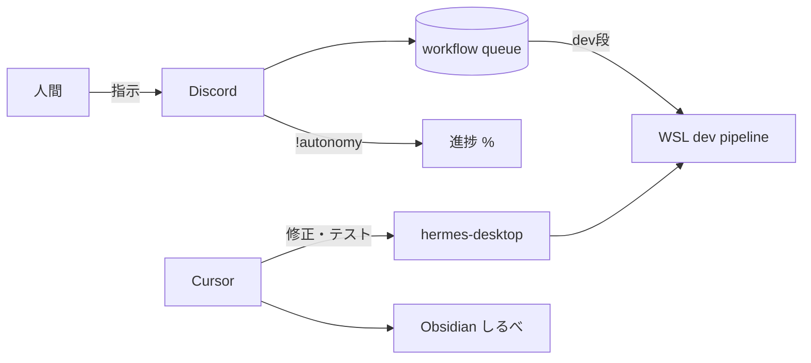

# 完全自律 55%→100% — Cursor 主戦場プレイブック

Date: 2026-05-31  
Status: 運用ガイド（git 正本）· Obsidian ミラーは `しきしま/inbox/` 同日ノート

関連:

- [FULL_AUTONOMY_MASTER_DESIGN_2026-05-31.md](FULL_AUTONOMY_MASTER_DESIGN_2026-05-31.md)
- [POST_RESTART_CHECKLIST_2026-05-31.md](POST_RESTART_CHECKLIST_2026-05-31.md)
- [AUTONOMY_STOP_INVESTIGATION_2026-05-30.md](AUTONOMY_STOP_INVESTIGATION_2026-05-30.md)
- [FULL_AUTONOMY_IMPLEMENTATION_WAVES_2026-05-30.md](FULL_AUTONOMY_IMPLEMENTATION_WAVES_2026-05-30.md)
- [DESIGN_INVENTORY_2026-05-30.md](DESIGN_INVENTORY_2026-05-30.md)

---

## 1. 「55%」とは何か

`node scripts/shikishima-autonomy-status.mjs` の **全体** 行は、次の加重平均（おおよそ）:

| 内訳 | 重み | 意味 |
|------|------|------|
| Wave W1–W6 | 35% | 設計波の完了（open は 35% 換算） |
| INVENTORY | 25% | SC/SHI/CHI/GAP の done/total |
| Human-GO readiness | 20% | Track D / burn-in / agent team 等 |
| ワークフロー | 20% | キュー各件の段階 % の平均 |

**55% は「設計・運用の準備が半分以上」であり、憲法 `execution=enabled` や git push 解禁を意味しない。**

---

## 2. 100% と HOLD の関係

| 到達 | 意味 |
|------|------|
| **100%（進捗メーター）** | W5 開発レーン整備、INVENTORY 消化、readiness 向上、WF が human 以外で進む状態が続く |
| **不変 HOLD** | `decision=HOLD` · `execution=disabled` · `productionReady=false` · 憲法 execute / FX 本番 / CKT 本番 / W6 Jarvis C/D |

人間が許可するのは **危険境界のみ**（憲法 GO スコープ、push、本番ループ等）。日常のコード改善は **Cursor** で継続可。

---

## 3. 役割分担（どこで何をするか）

| 場所 | 役割 | 典型操作 |
|------|------|----------|
| **Cursor** | 実装・テスト・ドキュメント・preflight 診断 | vitest、型修正、W5 コード、本プレイブック更新 |
| **Discord SideBot** | キュー投入・tick・進捗表示・人間 ack | `!autonomy progress` · `!workflow status` · `!workflow done` |
| **WSL** | 開発レーン実行（subscription-first） | `claude login` · `codex` · Hermes brain |
| **Obsidian（しるべ）** | 判断・調査の永続メモ | 本ノートの Daily / inbox ミラー |



---

## 4. 55%→100% の進め方（チェックリスト）

### M-07 — W5 開発レーン（SHI-010〜014）

| ID | 項目 | 状態（2026-05-31 完遂） | Cursor / 人間 |
|----|------|-------------------------|---------------|
| M-07a | `node scripts/shikishima-wsl-dev-preflight.mjs --json` | WSL OK · **claude login OK** · **codex OK** · Win agent **CLI あり**（login 任意） | 検証済 |
| M-07b | `SHIKISHIMA_DEV_PIPELINE_ENABLED=1` | **ON** | `.env.local` 設定済 |
| M-07c | `!dev-pipeline` / `!autonomy progress` | **ON** · chain 3 · WF 4件 done | Discord 検証済 |
| M-07d | `!kaihatu-test` | zone: `full-autonomy-kaihatu-auto-review` 等 | vitest + 司令部任意 |
| SHI-010 | Windows `agent` CLI | **done**（login 2026-05-31） | 3-leg chain · `dev_pipeline` READY |
| SHI-012 | WSL `claude login` | **OK**（root セッション） | 検証済 |

### ワークフロー（Discord + 人間 ack）

- **human 段**は tick で進まない → `!workflow done` または `!workflow continue`（B: 次 cycle dev）
- `wf-mpssr7ss`: **done**（2026-05-31 `!workflow done`）— キュー未完了 0 件時は WF 加重 100%

### INVENTORY / Wave（Cursor）

- W2–W4: done（ドキュメント・vitest）
- W5: **done**（M-07 完遂 2026-05-31）
- W1 StackChan 聴感・W6 Phase C/D: 人間 GO または deferred
- **2026-05-31 Phase A**: SHI-006 `done` · SHI-001/004 `mitigated`（preflight 診断・gates-audit）· SHI-005 は人間が operator ID 設定まで `open`
- **2026-05-31 続き**: WF 全件 done · handoff 無効化を Bot の `merged` env でも効くよう修正 · `wf-mptkemjr` 完了

### 続きチェックリスト（この順）

| # | 内容 | 担当 |
|---|------|------|
| 1 | `node scripts/shikishima-env-operator-patch.mjs <Discord ID>` | 人間（.env.local） |
| 2 | `node scripts/shikishima-process-preflight.mjs --clean --restart-dev` | PowerShell |
| 3 | Discord `!multi-room-test` · `!autonomy progress` | **完了**（OK · 対話6 · 通知送信 2026-05-31） |
| 4 | `agent login` | **done**（SHI-010）— `agent login` → preflight → `dev-pipeline-probe` |
| 5 | 新規 EA 自動 enqueue 抑止 | `SHIKISHIMA_WORKFLOW_HANDOFF_DISABLE=1`（`.env.local` 設定済 · Bot `mergedEnv` 経由で `ensureWorkflowFromHandoff` が skip） |
| 6 | ワークフロー投入 | **`!workflow enqueue` は必要時のみ**（handoff 自動 enqueue は OFF · 明示 enqueue のみ） |

### Phase 4–7 実施記録（2026-05-31）

| Phase | 結果 |
|-------|------|
| 4 | `wf-mptmecps` **dev ok** → done |
| 5 | obsidian dry-run OK · `dev-status-briefing` OK（読取のみ） |
| 7 | [HUMAN_GO_BOUNDARIES.md](HUMAN_GO_BOUNDARIES.md) 作成 |

境界一覧: [HUMAN_GO_BOUNDARIES.md](HUMAN_GO_BOUNDARIES.md)

### Human-GO readiness（2026-05-31 再実行 · A4）

`node scripts/shikishima-human-go-readiness.mjs` — **READY 5/9**（`dev_pipeline` · `codex_leg` 昇格）· `decisionForAutomation=GO_PREPARED` · `openGaps=0`（憲法 `execution=enabled` は不変 HOLD）

Phase 1 実施: `run-ordered-tasks`（maintenance interval skip は正常）· `run-autonomy-gap-tasks` **ALL OK 5/5**

**稼働中注記（tick / capped）**

| コンポーネント | 状態 | 備考 |
|----------------|------|------|
| `agent_team_tick` | PARTIAL · **稼働中** | 30m 間隔 · orchestrator 経由 · `interval_not_elapsed` は正常 skip |
| `autonomous_orchestrator` | PARTIAL · **稼働中** | SideBot spawn · 15m maintenance · capped（外部 Discord 送信なし） |
| `autonomy.maintenance` | capped | min_interval 未到達時 exit=2 は expected（ordered-tasks Task1a） |

| id | status | メモ |
|----|--------|------|
| track_d | READY | operational-release local active |
| obsidian_write | READY | vault path OK |
| burn_in_wall | READY | ticks≥280 · humanAck |
| constitutional | PARTIAL | scopes=8（execute 有効化は別 GO） |
| agent_team_tick | PARTIAL | every 30m · SideBot orchestrator 経由 |
| autonomous_orchestrator | PARTIAL | every 15m maintenance · capped |
| dev_pipeline | READY | ON · 3-leg · win agent login OK · composer `--trust -f` |
| codex_leg | READY | wsl-codex-cli login OK |
| unbounded_discord | BLOCKED | 意図的 |

### W1 StackChan — 聴感（質問票「今すぐ」）

[HUMAN_GO_QUESTIONNAIRE_2026-05-30.md](HUMAN_GO_QUESTIONNAIRE_2026-05-30.md) で **今すぐ** 選択済み。Cursor は本番 Discord 送信・`--speak` なしで診断のみ可。

| 手順 | コマンド / 確認 |
|------|-----------------|
| 1 | `node scripts/shikishima-stackchan-voice-check.mjs`（VOICEVOX + WS） |
| 2 | VOICEVOX 未起動なら起動 → 再チェック |
| 3 | 人間 GO 後: `node scripts/shikishima-stackchan-resume.mjs` または `preflight --clean --restart-dev` |
| 4 | 任意: `shikishima-voice-pilot-once.mjs` · Discord 短返信で聴感 |
| 5 | `STACKCHAN_HOLD` 解除は `stackchan-resume.mjs`（音声本番は stackchan.voice ゲート要 GO） |

2026-05-31 実行 (Cursor roadmap): `voicevoxReady=true` · `connected=true` · `--speak` ok · `voice-pilot-once` ok · `stackchan-resume` · `preflight --clean --restart-dev`. 聴感ゲート(技術): speakTest OK。`DISCORD_OPERATOR_USER_ID`=missing → `!multi-room-test` は人間が ID 設定後。

**2026-05-31 本線（Cursor）**: Codex/Cursor 音声経路 — chunk 96 · poll-batch 順序読み · `voice_busy` · digest 中 notify defer。vitest 31/31。**実機**: 司令部 1 通短文 + **3 通連続 + 読み上げ中 `!sc nod` すべて PASS**（人間 GO 2026-05-31 · [CODEX doc](./CODEX_STACKCHAN_DISCORD_VOICE_FIX_REQUEST_2026-05-31.md)）。

**人間GO後（2026-05-31）**: [POST_HUMAN_GO_NEXT_STEPS_2026-05-31.md](./POST_HUMAN_GO_NEXT_STEPS_2026-05-31.md) — Obsidian 実書き許可 · 進捗 77% · execution=enabled は別 GO · W6 deferred。

---

## 5. ワークフロー dev が失敗する理由（runKaihatuDev）

調査日: 2026-05-31（キュー・preflight・コード読取）

### 5.1 失敗の流れ

1. `advanceWorkflowItem` の **dev** 段で `runKaihatuDev(instruction, env)` を呼ぶ
2. `validateKaihatuGate`: `SHIKISHIMA_DEV_PIPELINE_ENABLED` が truthy でない → **即 fail**（しずめメッセージ）
3. gate OK でも `runDevPipeline` が composer→claude→codex を試行し、**ログイン未完了**等で fail
4. `lastDevOk=false` のまま research→record→eval→**human**（eval HOLD / dev 2回失敗）

### 5.2 2026-05-31 preflight スナップショット（要約）

| 項目 | 結果 |
|------|------|
| WSL 到達 | OK |
| composer チェーン | hermes-brain（フォールバック） |
| WSL claude | present · **loggedIn: false** |
| WSL codex | present · loggedIn: true |
| Windows agent | **present: false** |
| dev-pipeline 有効フラグ | 環境により **OFF**（`!autonomy` でも OFF 表示） |

### 5.3 旧ログとの区別

- `eval HOLD → auto loop dev` は **修正前**（現行は HOLD→**human**）
- 参考: [AUTONOMY_STOP_INVESTIGATION_2026-05-30.md](AUTONOMY_STOP_INVESTIGATION_2026-05-30.md)

### 5.4 復旧の優先順

1. `.env.local` で `SHIKISHIMA_DEV_PIPELINE_ENABLED=1`
2. `node scripts/shikishima-wsl-dev-preflight.mjs` 更新
3. WSL `claude login`（任意: Windows `agent` install）
4. Discord `!dev-pipeline` でチェーン・ログイン行を確認
5. `!workflow continue wf-mpssr7ss` または Cursor で dev 失敗理由を governance 確認

---

## 6. Cursor で進めるタスク（今セッション型）

```powershell
Set-Location "c:\Users\81903\Desktop\プロジェクトファイル\hermes-desktop"

node scripts/shikishima-wsl-dev-preflight.mjs --json
node scripts/shikishima-autonomy-status.mjs
npx vitest run tests/hermes/zone/full-autonomy/full-autonomy-progress.test.ts tests/hermes/zone/full-autonomy/full-autonomy-workflow-resume.test.ts
```

- W5 可視性: `autonomy-progress` の停止要因に dev-pipeline / login ヒント（コード）
- INVENTORY: SHI-011〜014 は preflight 合格後に `done` へ（数値は正直にのみ更新）
- docs: 本ファイル · MASTER_DESIGN · WAVES へのリンク

---

## 7. Discord コマンド（ユーザー向け）

| コマンド | 用途 |
|----------|------|
| `!autonomy progress` | 全体 % · dev-pipeline · 停止要因 |
| `!dev-pipeline` | SHI-010–014 詳細チェーン・ログイン |
| `!workflow status` | キュー各件 |
| `!workflow done` | human 段を完了 |
| `!workflow continue` | B: 次 cycle の dev へ |
| `!workflow continue wf-mpssr7ss` | 特定 ID |
| `!human-go` | readiness 一覧 |

SideBot 停止時: `node scripts/shikishima-process-preflight.mjs --clean --restart-dev`（人間判断）

---

## 8. 進捗を上げるときの正直なルール

- `AUTONOMY_WAVES` / `INVENTORY_TRACKS` の数値は **検証完了後のみ** 更新
- dev-pipeline OFF のまま W5 を done にしない
- 100% 到達後も **憲法 execute は人間 GO**

### ワークフロー handoff 抑止（B3）

| 設定 | 意味 |
|------|------|
| `SHIKISHIMA_WORKFLOW_HANDOFF_DISABLE=1` | 起動時 `handoff.json` → 自動 enqueue **禁止** |
| `!workflow enqueue` | **必要時のみ** 明示投入（EA 研究等） |
| vitest | `full-autonomy-workflow-handoff-env.test.ts` — env 引数で `handoff_disabled` を確認 |

Bot は `bootstrapWorkflowResume` / `ensureWorkflowFromHandoff` で `{ ...readEnv(), ...process.env }` を渡すため、`.env.local` の設定が merged env に反映される。

---

*Generated for しきしま完全自律運用 · 2026-05-31*
