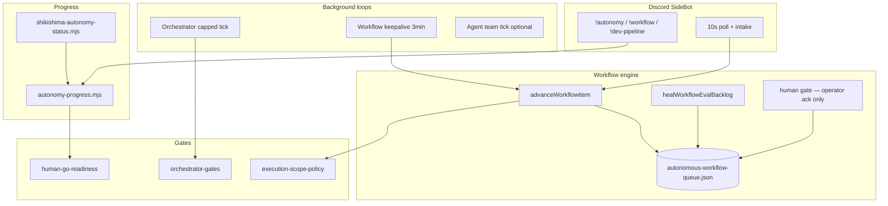

# しきしま完全自律 — マスタ設計（2026-05-31）

Date: 2026-05-31  
Status: 設計正本（実装は Wave / INVENTORY に追従）  
関連:

- [FULL_AUTONOMY_IMPLEMENTATION_WAVES_2026-05-30.md](FULL_AUTONOMY_IMPLEMENTATION_WAVES_2026-05-30.md)
- [DESIGN_INVENTORY_2026-05-30.md](DESIGN_INVENTORY_2026-05-30.md)
- [JARVIS_PHASE_A_D_ROADMAP_2026-05-31.md](JARVIS_PHASE_A_D_ROADMAP_2026-05-31.md)
- [AUTONOMY_STOP_INVESTIGATION_2026-05-30.md](AUTONOMY_STOP_INVESTIGATION_2026-05-30.md)
- [AUTONOMY_55_TO_100_CURSOR_PLAYBOOK_2026-05-31.md](AUTONOMY_55_TO_100_CURSOR_PLAYBOOK_2026-05-31.md)
- [STACKCHAN_GATE_MATRIX.md](STACKCHAN_GATE_MATRIX.md)

---

## 1. 目標状態の定義

### 1.1 「完全自律」と呼ぶもの（このリポジトリ内）

| 層 | 目標 | 憲法・安全 |
|----|------|------------|
| **運用自律** | SideBot 起動中、オーケストレータ tick・ワークフロー keepalive・agent-team local tick が **cap 内**で継続 | `decision=HOLD` 維持可 |
| **開発自律** | 指示→dev→research→record→eval→**human**→（人間 ack）→done のパイプラインが止まらず進む | `execution=disabled` |
| **可視性** | `!autonomy progress` / CLI で %・停止要因・dev-pipeline チェーンが一目でわかる | 秘密・生パス非表示 |
| **人間 GO** | 危険境界のみ明示 ack（憲法 execute、git push、本番 Discord ループ、FX/EA、CKT 等） | 常に **H** まで |

### 1.2 完全自律 **ではない** もの（不変 HOLD）

- `constitutional execution=enabled`（本番自動実行）
- `productionReady=true`（グローバル）
- git push / ライブ売買 / 24h 無制限コーディング
- Chisiki **CHI-C**（CKT・ウォレット・RPC 本番）
- Jarvis **Phase C/D**（生活読取・金融執行）— [W6 deferred](FULL_AUTONOMY_IMPLEMENTATION_WAVES_2026-05-30.md)
- StackChan 常時発話（`SHIKISHIMA_STACKCHAN_HOLD=1` 運用中は OFF）

**100% 進捗 ≠ 上記 HOLD の解除。**

---

## 2. アーキテクチャ



| コンポーネント | パス | 役割 |
|----------------|------|------|
| オーケストレータ | `scripts/shikishima-autonomous-orchestrator.mjs` | maintenance / gap / readiness 集約（Discord 送信なし） |
| ワークフロー引擎 | `scripts/lib/autonomous-workflow-engine.mjs` | キュー段階遷移・heal・human ack |
| 再開 | `scripts/lib/workflow-resume.mjs` | checkpoint・burst・handoff enqueue |
| Agent team | `scripts/shikishima-agent-team-tick*.mjs` | 6体協調（local-only 既定） |
| 進捗 | `scripts/lib/autonomy-progress.mjs` | W1–W6 / INVENTORY / WF / readiness 加重 % |
| 開発レーン | `scripts/lib/dev-pipeline-router.mjs` | composer→claude→codex（subscription-first） |

---

## 3. Phase マップ（W1–W6 × INVENTORY）

| Wave | INVENTORY 主 ID | G/H | 設計状態 |
|------|-----------------|-----|----------|
| W1 StackChan ops | SC-001–007 | G+H | **done**（技術+聴感 2026-05-31） |
| W2 Discord voice | SC-014a/b | G done | done |
| W3 Chisiki research | CHI-001–005 | G done | done（CHI-C は H deferred） |
| W4 Billing doc | CHI-005, BILLING_QUOTA | G done | done |
| W5 Dev lane | SHI-010–014 | G | **done**（2026-05-31） |
| W6 Phase C/D | Jarvis C/D | H deferred | 実装しない |

---

## 4. データフロー（秘密なし）

1. **Discord 指示** → `enqueueWorkflow` → `.shikishima-memory/autonomous-workflow-queue.json`
2. **dev 段** → `runKaihatuDev`（WSL / Hermes brain / agent CLI — 設定依存、キーはログに出さない）
3. **eval 段** → `runKaihatuAutoReview` → `evalDecision` / `evalNeedsHuman`（HOLD は human へ）
4. **human 段** → tick **スキップ** · `!workflow done` または `completeWorkflowHuman` のみ done
5. **進捗** → `buildAutonomyProgressReport` → Discord `!autonomy progress` / CLI
6. **preflight** → `wsl-dev-preflight-snapshot.json`（パス・ログイン状態の要約のみ）

---

## 5. Human GO ゲート行列（抜粋）

| ゲート ID | 内容 | 既定 | 解除手段 |
|-----------|------|------|----------|
| CONSTITUTIONAL | execution=enabled | H | 明示憲法 GO ファイル + 人間 |
| AUTOMATION | decisionForAutomation | HOLD | Track D / burn-in（別 doc） |
| SCOPE_DEV | autonomous_dev | env GO | `shikishima-record-execution-scope-go.mjs` |
| WF_HUMAN | workflow human 段 | 人間待ち | `!workflow done [id]` |
| STACKCHAN_VOICE | 発話・Discord VOICEVOX | H | HOLD 解除 + 聴感 G |
| CHI-C | オンチェーン | H | 質問票 C → 別 GO |
| GIT_PUSH | remote push | H | 明示指示のみ |
| W6_JARVIS_CD | 生活・金融 | H | Phase E 以降 |

詳細: [STACKCHAN_GATE_MATRIX.md](STACKCHAN_GATE_MATRIX.md), [ORCHESTRATOR_GATES_AUDIT_2026-05-30.md](ORCHESTRATOR_GATES_AUDIT_2026-05-30.md)

---

## 6. 実装チェックリスト（G/H）

| ID | 項目 | G/H | Status |
|----|------|-----|--------|
| M-01 | 進捗 % CLI + Discord | G | done |
| M-02 | eval 滞留 heal → human | G | done |
| M-03 | human 段 tick 自動 done 禁止 | G | done（2026-05-31） |
| M-04 | `!workflow done` 人間 ack | G | done |
| M-05 | 起動時 heal + autonomy ログ行 | G | done |
| M-06 | `!autonomy` dev-pipeline 1行 | G | done |
| M-07 | W5 preflight / agent login | G/H | done（agent login 任意） |
| M-08 | StackChan 聴感再開 | H | done（常時発話ループは別 GO） |
| M-09 | 憲法 execution=enabled | H | deferred |
| M-10 | CHI-C オンチェーン | H | deferred |

---

## 7. 検証コマンド

```powershell
Set-Location "c:\Users\81903\Desktop\プロジェクトファイル\hermes-desktop"
node scripts/shikishima-autonomy-status.mjs
node scripts/shikishima-orchestrator-gates-audit.mjs
npx vitest run tests/hermes/zone/full-autonomy
node scripts/shikishima-process-preflight.mjs --clean --restart-dev
```

Discord: `!autonomy progress` · `!workflow status` · `!workflow done` · `!dev-pipeline`

---

## 8. 再起動後オペレーター

[POST_RESTART_CHECKLIST_2026-05-31.md](POST_RESTART_CHECKLIST_2026-05-31.md)（コマンド一覧）

調査ログ: [AUTONOMY_STOP_INVESTIGATION_2026-05-30.md](AUTONOMY_STOP_INVESTIGATION_2026-05-30.md) § post-restart
