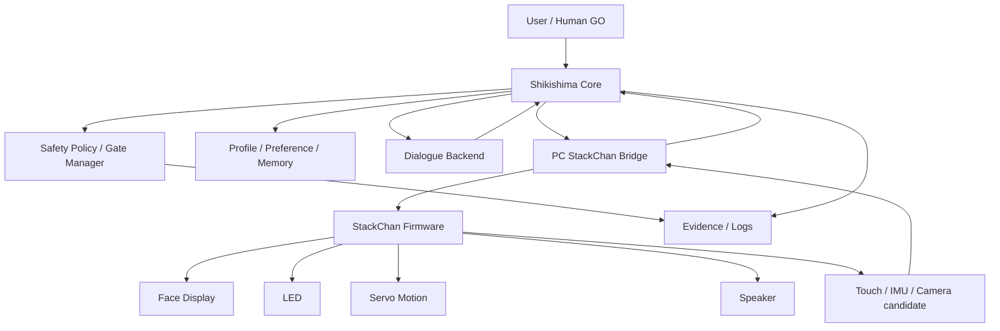

# SC-SECRETARY-01 Full System Architecture

date: 2026-05-25
status: DESIGN_READY
scope: StackChan AI secretary full architecture

## Goal

Build StackChan into a Shikishima secretary body.

The secretary should eventually:

- answer through voice
- show state through face / LED / servo motion
- help the user manage tasks and routines
- use camera context only under explicit safety gates
- preserve preferences and forbidden phrases
- escalate risky actions to human GO

This document does not approve implementation, continuous monitoring, microphone always-on, external API writes, productionReady true, or execution enabled.

## System Roles

| Component | Role |
| --- | --- |
| Shikishima core | brain, policy, task routing, memory, safety judgment |
| StackChan firmware | face, LED, servo motion, touch/IMU input, speaker output |
| PC bridge | local routing between Shikishima and StackChan |
| Voice backend | text-to-speech / local or approved route |
| Dialogue backend | local LLM first, future Grok route later |
| Camera route | one-shot still image first, future gated observation later |
| Evidence docs | decision record, safety trace, acceptance |

## Architecture Diagram



## Core Data Flow

### One-Shot Dialogue

```text
user prompt
-> Shikishima prompt builder
-> profile / forbidden phrase policy
-> dialogue backend
-> response safety filter
-> StackChan face / motion / voice
-> evidence summary
-> gate restored HOLD
```

### Future Camera One-Shot

```text
human GO
-> one still image
-> privacy check
-> safe image summary prompt
-> one comment
-> optional StackChan voice output
-> image discarded unless evidence explicitly allows redacted reference
```

### Future Periodic Secretary

```text
local schedule
-> check-in candidate
-> no camera/mic by default
-> one brief voice prompt
-> no retry loop
-> user can pause
```

## Secretary Modes

| Mode | Description | Risk | Default |
| --- | --- | --- | --- |
| `desk_companion` | reactive voice/face/motion | low | allowed after local checks |
| `task_secretary` | reads and summarizes tasks | medium | gated by source |
| `voice_dialogue_one_shot` | one prompt, one response, one voice output | medium | GO required |
| `camera_one_shot` | one safe still image comment | high | GO required |
| `periodic_checkin` | scheduled reminders without sensing | medium | HOLD |
| `camera_aware_checkin` | low-frequency camera context | high/critical | HOLD |
| `continuous_monitoring` | always-on camera/mic | critical | not approved |

## Agent Mapping

| Agent | Secretary role | StackChan face/motion style |
| --- | --- | --- |
| しきしま | main secretary / calm controller | `listen_ready`, `aiagent_speak`, normal face |
| しずめ | safety gate / STOP / privacy | `safety_hold`, `panic_stop`, 焦り |
| はじめ | planning / task breakdown | `thinking_scan`, ノーマル |
| つむぎ | implementation / action progress | `task_accept`, 頑張るぞ |
| しるべ | records / summaries / evidence | `task_done`, 笑顔 |

## Personality Contract

The secretary should:

- speak briefly
- ask before sensing
- avoid overclaiming what it saw
- avoid forbidden phrases
- clearly say when a gate is HOLD
- use "見守り" rather than "監視"
- propose, not command

## Non-Goals For First Implementation

- no always-on camera
- no always-on microphone
- no autonomous Discord/X/Obsidian write
- no financial position execution
- no productionReady true
- no execution enabled
- no cloud upload of images/audio without explicit GO

## Design Completion State

Architecture: ready for implementation planning.  
Implementation: HOLD until the task pack is selected.
