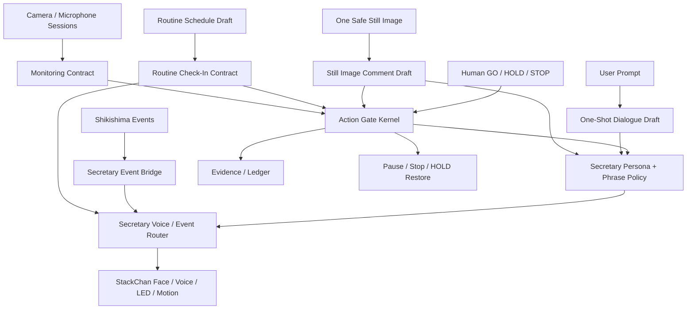

# SC-SECRETARY Phase 1-6 Build-In Design

date: 2026-05-25
status: BUILDIN_IMPLEMENTED_PASS_CANDIDATE
scope: StackChan AI secretary phased build-in

## Purpose

Define the complete Phase 1-6 path for turning StackChan into the Shikishima AI secretary.

This document explains what each phase enables, what source modules should own the behavior, which gates must remain visible, and what must be tested before moving to the next phase.

The goal is not to make StackChan uncontrolled or always-on immediately. The goal is to build a secretary system that can:

- answer briefly through StackChan voice
- preserve persona and forbidden phrase policy
- react with face / LED / motion
- comment on one safe still image
- run low-frequency local check-ins
- bridge Shikishima events to StackChan
- eventually run bounded camera/microphone sessions
- escalate external writes, productionReady, and execution enabled through explicit GO

## Current Foundation

Already implemented or partially implemented:

- StackChan local voice path
- StackChan face / LED / motion path
- SCS servo path
- pat / nuzzle motion
- secretary persona and phrase filter
- secretary voice router draft
- one-shot dialogue draft
- routine check-in draft
- event bridge draft
- one-still-image comment policy draft
- monitoring contract draft
- external write draft
- Lv5 transition draft support
- secretary runtime coordinator
- pause / stop contract
- routine scheduler adapter
- still image intake adapter
- sensor session runtime wrapper
- external write executor guard
- status snapshot

Important current invariants:

```text
productionReady global state: still false
execution global state: still disabled
rawValuesReported: false
```

The repository currently treats `productionReady: false` and `execution: disabled` as shared safety invariants. Phase 1-6 build-in should therefore move through explicit transition layers before changing global state.

## System Architecture



## Phase 1 - One-Shot Secretary

### Goal

One prompt creates one answer. The answer can optionally be spoken once by StackChan.

### User Experience

The user asks something simple:

```text
今日の作業状態を教えて
```

Shikishima drafts a short response and StackChan speaks only the approved short line:

```text
今は安全に確認中です。次は画像1枚コメントの準備です。
```

### Required Behavior

- one prompt -> one answer
- optional one voice output
- no voice loop
- no microphone always-on
- no camera
- no external write
- no raw token / local path / raw address in speech
- forbidden phrase policy applies before voice
- voice should be short

### Source Ownership

Implemented / target modules:

- `src/main/shikishima-core/profile-policy.ts`
- `src/main/shikishima-core/response-policy.ts`
- `src/main/shikishima-core/secretary-dialogue-policy.ts`
- `src/main/shikishima-core/secretary-voice-router.ts`
- `scripts/shikishima-secretary-filter.mjs`
- `scripts/shikishima-stackchan.mjs`

### Gate

```text
SC-AI-01
```

### Acceptance Criteria

PASS when:

- one prompt returns one draft answer
- one voice output can be executed under GO
- no repeated speech occurs
- forbidden phrase replacement works
- raw-looking values are redacted or blocked
- StackChan connection remains stable after speech

### Evidence

Required:

- `SC_AI_01_VOICE_ONE_SHOT_EVIDENCE_YYYY-MM-DD.md`
- `SC_SECRETARY_07_ROADMAP_IMPLEMENTATION_EVIDENCE.md`

### Current Status

```text
status: PASS_CANDIDATE
one-shot voice: command route PASS
human acoustic confirmation: still useful
```

## Phase 2 - Event Reaction Secretary

### Goal

Shikishima events cause StackChan to react in a short, understandable, non-executing way.

### Event Examples

| Event | Agent | Face | Motion | LED |
| --- | --- | --- | --- | --- |
| task done | つむぎ | happy | task_done | green |
| HOLD | しずめ | thinking | safety_hold | yellow |
| STOP | しずめ | panic | panic_stop | red |
| evidence created | しるべ | normal | task_done | green |
| FX thesis summary | ちはや | thinking | thinking_scan | yellow |

### Required Behavior

- event -> draft voice route
- event -> face / LED / motion recommendation
- no device execution unless a GO path approves it
- no external write
- FX remains thesis-only
- STOP/HOLD presentation must override persona flavor

### Source Ownership

- `src/main/shikishima-core/secretary-event-bridge.ts`
- `src/main/shikishima-core/secretary-voice-router.ts`
- `src/main/shikishima-core/model-assignment-registry.ts`
- `scripts/shikishima-stackchan.mjs`

### Gate

```text
SC-SECRETARY-EVENT-BRIDGE
```

### Acceptance Criteria

PASS when:

- task_done event maps to task_done presentation
- HOLD event maps to safety_hold presentation
- STOP event maps to panic_stop presentation
- FX summary is informational only
- no external action is executed by event conversion

### Current Status

```text
status: PASS_CANDIDATE as draft layer
runtime event wiring: not fully connected
```

## Phase 3 - Routine Check-In Secretary

### Goal

StackChan can give gentle low-frequency check-ins without becoming annoying or uncontrolled.

### Examples

```text
少し休憩しましょう。
水分をとりましょう。
作業を一区切りにしますか？
今日の証跡を軽くまとめますか？
```

### Required Behavior

- explicit routine ID
- bounded minimum interval
- bounded max runs per day
- no retry loop
- no nagging escalation
- pause and stop available
- voice output still uses GO or configured approved routine
- no camera/mic by default

### Source Ownership

- `src/main/shikishima-core/secretary-routine-checkin.ts`
- future runtime scheduler adapter
- future evidence ledger adapter

### Gate

```text
SC-ROUTINE-CHECKIN
```

### Default Bounds

```text
minimumIntervalMinutes: >= 15
maxRunsPerDay: <= 8
retryLoop: false
naggingEscalation: false
```

### Acceptance Criteria

PASS when:

- check-in draft clamps too-short intervals
- max runs per day is bounded
- stop/pause exists
- repeated reminders do not escalate
- voice follows phrase policy

### Current Status

```text
status: PASS_CANDIDATE as draft model
actual scheduler: not started
```

## Phase 4 - One-Shot Camera Comment

### Goal

Use one user-approved still image to produce one safe, general comment.

### User Experience

The user gives a safe still image or explicitly captures one image. Shikishima comments:

```text
机の上が少し散らかっているので、作業前に一か所だけ整えるとよさそうです。
```

### Required Behavior

- one still image only
- user privacy confirmation required
- no continuous monitoring
- no face identification
- no identity recognition
- no private screen / credentials reading
- no default image retention
- no external upload unless separately approved

### Source Ownership

- `src/main/shikishima-core/secretary-camera-comment-policy.ts`
- future image intake adapter
- future vision model adapter if local model is available

### Gate

```text
SC-CAM-01
```

### Acceptance Criteria

PASS when:

- image source is explicit
- privacy confirmation is recorded
- no visible people or private data
- prompt includes identity-recognition prohibition
- result is one safe sentence
- evidence records image handling policy

### Current Status

```text
status: policy layer implemented
actual image analysis: not yet executed
```

## Phase 5 - Bounded Sensor Sessions

### Goal

Prepare tightly bounded camera/microphone sessions for real secretary behavior without uncontrolled monitoring.

### Modes

```text
camera_continuous
microphone_always_on
voice_loop
```

These names are high-risk. In the actual system they must be bounded sessions, not unlimited daemons.

### Required Behavior

- human GO ticket
- local-only mode
- private space confirmation
- max duration
- pause command
- stop command
- evidence path
- no retry loop
- no background daemon
- no external upload
- no identity recognition

### Source Ownership

- `src/main/shikishima-core/secretary-monitoring-contract.ts`
- future local camera runtime service
- future local microphone/STT runtime service
- future stop switch integration

### Gate

```text
SC-CAM-MONITOR
SC-MIC-SESSION
SC-VOICE-LOOP
```

### Recommended Initial Bounds

```text
camera_continuous: max 300 seconds
microphone_always_on: max 300 seconds
voice_loop: max 180 seconds
```

### Acceptance Criteria

PASS when:

- session cannot start without GO ticket
- duration is clamped
- pause works
- stop works
- no external upload
- no identity recognition
- evidence records start/end and stop reason

### Current Status

```text
status: monitoring contract implemented
actual runtime service: not started
```

## Phase 6 - Autonomous Secretary v1

### Goal

StackChan becomes a useful desk-side secretary that can speak, react, remind, summarize, and cautiously observe short sessions.

### Capabilities

Allowed under v1:

- one-shot voice answers
- event reactions
- routine check-ins
- one-still-image comments
- bounded local camera/mic sessions after GO
- draft external messages
- draft task summaries
- explain HOLD / STOP clearly

Still gated:

- external write
- Discord send
- X / social write
- Obsidian write unless scoped
- productionReady global true
- execution global enabled
- long-running autonomous camera/mic
- purchasing / reservation / payment
- trading

### Source Ownership

- all Phase 1-5 modules
- `src/main/shikishima-core/secretary-lv5-activation.ts`
- future secretary runtime coordinator
- future stop/pause panel
- future evidence ledger integration

### Gate

```text
SC-SECRETARY-99
PRODUCTION-READY
EXECUTION-ENABLE
```

### Acceptance Criteria

PASS when:

- Phase 1 PASS
- Phase 2 PASS
- Phase 3 PASS
- Phase 4 PASS if camera used
- Phase 5 PASS if continuous sessions used
- phrase policy works in actual speech path
- stop/pause works
- evidence is complete
- user accepts behavior
- productionReady transition has its own GO
- execution enabled transition has its own GO

### Current Status

```text
status: foundation built
secretary v1 runtime coordinator: not implemented
global productionReady transition: not performed
global execution transition: not performed
```

## Build-In Sequence

Recommended implementation order:

```text
1. Finish and commit local foundation.
2. Add Secretary Runtime Coordinator.
3. Add pause/stop state.
4. Add one-shot dialogue UI/command path.
5. Add routine check-in scheduler in paused-by-default mode.
6. Add one-still-image intake.
7. Add bounded sensor session runtime.
8. Add external write draft executor with one-shot GO only.
9. Add final secretary readiness dashboard.
10. Run SC-SECRETARY-99 acceptance.
11. Decide productionReady / execution migration separately.
```

## Non-Negotiable Safety Rules

- raw tokens/secrets/local-only values must not be spoken
- camera must not identify people
- microphone must not run indefinitely
- external writes require GO
- no retry loop
- no background daemon without explicit session contract
- all high-risk sessions return to HOLD
- every Level 5 run needs evidence

## Open Implementation Gaps

```text
secretary_runtime_coordinator: implemented
pause_stop_state: implemented
routine_scheduler_runtime: implemented as paused-by-default adapter
image_intake_adapter: implemented
vision_comment_adapter: missing
microphone_session_adapter: missing
external_write_executor: implemented as guarded adapter
secretary_dashboard: status snapshot implemented / UI missing
global_productionReady_migration: not started
global_execution_enabled_migration: not started
```

## Final Design Position

The correct path is:

```text
use StackChan as an embodied local secretary first
make every high-risk action bounded and visible
only then consider global productionReady / execution enabled
```
