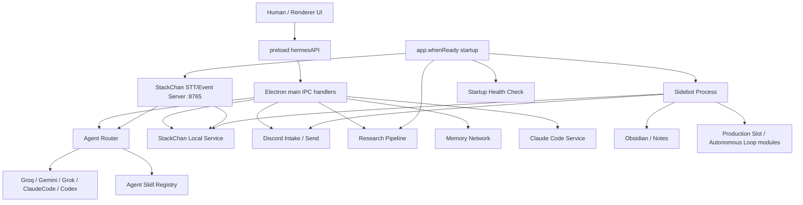

# Shikishima Agent Architecture Audit — 2026-05-24

## Result

```text
status: PREIMPLEMENTATION_AUDIT_COMPLETE
scope: Shikishima agent design / autonomy / execution boundary
runtime_started: false
stackchan_controlled: false
discord_action_performed: false
obsidian_written: false
x_search_executed: false
git_push_performed: false
productionReady: false
execution: disabled
rawValuesReported: false
```

## Purpose

ClaudeCode 側で進んだ大型アップデート後の全貌を、実装前に Codex が監査した記録。

目的は、いまの設計での穴・脆弱性・自律実行リスクを洗い出し、次の再構築実装に進む前の判断材料を作ること。

## Current Architecture Map



## High-Risk Findings

### 1. Startup side effects are not centrally gated

`src/main/index.ts` starts multiple live systems during `app.whenReady()`:

- daily research pipeline
- sidebot process
- StackChan local status check
- startup health check that can send Discord
- StackChan STT/event/camera server

Risk:

```text
App launch can activate external reads/writes, device paths, or background loops before a per-action human GO is recorded.
```

### 2. Renderer IPC exposes effectful actions directly

`src/preload/index.ts` exposes direct renderer calls such as:

- Grok chat through xai-oauth
- StackChan say / face / speed
- Discord read
- research publish
- library write dry-run
- model/config/memory writes

Risk:

```text
The UI can trigger external/model/device effects without a shared preflight gate, one-shot ledger, or Level 5 ticket.
```

### 3. StackChan STT server is a live LAN-facing event server

`src/main/stackchan-stt-service.ts` listens on `0.0.0.0:8765` and accepts:

- `/audio` -> Whisper STT -> agent callback
- `/event` -> pat event -> StackChan physical/voice reaction path
- `/camera` -> JPEG capture saved to local app data

Risk:

```text
Audio, touch, and camera inputs can enter the system outside the desktop UI.
Current design needs explicit auth, one-shot time windows, size limits, privacy checks, and default HOLD.
```

### 4. Sidebot is a parallel autonomous runtime

`src/main/sidebot-service.ts` starts a separate script and restarts it up to a configured limit.
The sidebot script contains direct Discord, webhook, memory, task, StackChan, STT, slot, and autonomous loop paths.

Risk:

```text
The sidebot can become a second control plane that bypasses Electron IPC policy and typed safety gates.
```

### 5. Agent skills execute side effects without preflight

`src/main/agent-skills/skill-registry.ts` detects skills by keyword and calls `skill.execute(...)` directly.
Some skills can run commands or write notes.

Risk:

```text
Skill metadata describes side effects only after routing. It must be converted into preflight approval before execution.
```

### 6. Discord and research gates are inconsistent

Observed issues:

- Discord read/send helpers can be active if token/channel config exists.
- Research publish writes notes and sends Discord output.
- Daily research scheduling is started automatically.

Risk:

```text
Read-only, write, publish, schedule, and one-shot behavior are mixed together.
```

### 7. Grok/Hermes command path uses a high-trust CLI mode

The Grok chat path shells into Hermes through WSL and uses a permissive command mode.

Risk:

```text
LLM execution path needs explicit mode separation: chat-only, read-only research, tool-use, and external-write must not share one launcher.
```

### 8. Electron hardening regression

`src/main/index.ts` appends sandbox-disabling switches.

Risk:

```text
Sandbox disabling increases blast radius if renderer or preload paths are compromised.
This should be treated as a security exception requiring justification or removal.
```

### 9. Raw local values can leak into UI or memory

Examples observed in structure:

- local device address fields surfaced through StackChan status
- local paths in capture/log handling
- long-term memory defaults may include local connection details

Risk:

```text
Renderer and docs should receive redacted labels, not raw LAN IPs, tokens, serial IDs, or local-only paths.
```

### 10. Safe Ichikishima gates exist but are not the only execution path

Safer modules exist under `src/main/ichikishima`, including path guards, voice gate, silence gate, and StackChan safety gate.

Risk:

```text
The project has good safety primitives, but live Shikishima paths are not forced through them.
```

## Current Strengths

- There is already a strong docs culture around GO/HOLD gates.
- StackChan firmware rollback and face asset planning are documented.
- Some low-level safety primitives exist for path checks and voice/motion gates.
- UI has visible status panels for Gate / Worker / Agent Theater concepts.
- The project distinguishes Level 4 local work from Level 5 external execution in policy docs.

## Immediate Safety Recommendation

Before more autonomous features are added:

```text
Freeze new Level 5 feature expansion.
Do not add new external effect paths.
Do not enable productionReady true.
Do not enable execution.
Move all existing external/device paths behind one ActionGateKernel.
```

## Acceptance Boundary

This audit does not approve:

- Discord send/read
- x_search
- Obsidian write
- StackChan speech/motion/camera
- STT server runtime
- sidebot runtime
- Hermes/WSL execution
- productionReady true
- execution enabled
- git push
