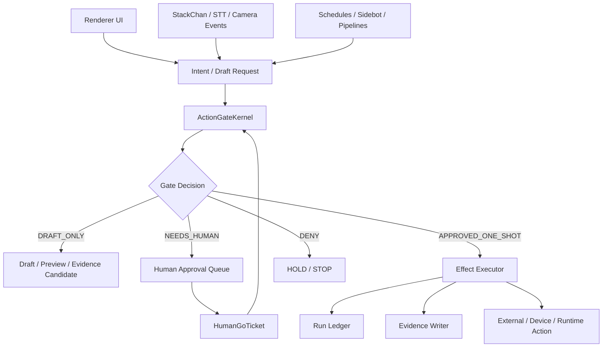

# Shikishima Agent Reconstruction Plan — 2026-05-24

## Goal

現在の多頭化したしきしま実装を、実運用前に安全な中核構造へ組み直す。

実装方針:

```text
AI may think, draft, check, and record.
AI may not execute outside-world actions without a HumanGoTicket.
```

日本語方針:

```text
AIは考えていい。
AIは下書きしていい。
AIは確認していい。
AIは記録していい。

外に送る、起動する、接続する、喋らせる、動かす、書き込む、本番化する。
ここは人間GO。
```

## Target Architecture



## Core Components To Introduce

### 1. ActionGateKernel

Single preflight layer for every action with side effects.

Required inputs:

```text
action_id
action_kind
actor
source
risk_level
requested_effects
target_summary
raw_value_policy
requires_human_go
allowed_run_count
time_window
evidence_path
rollback_or_disable_method
```

Required outputs:

```text
decision: ALLOW_DRAFT / NEEDS_HUMAN / APPROVED_ONE_SHOT / DENY / STOP
reason
redacted_summary
required_go_fields
ledger_candidate
```

### 2. HumanGoTicket

All Level 5 execution must carry an explicit ticket.

Fields:

```text
ticket_id
created_by
approved_by_human: true
gate_id
exact_action
time_window_jst
allowed_run_count
target
forbidden_actions
stop_conditions
evidence_file
after_action_hold_required
```

### 3. Effect Executor

Only this layer may perform:

- Discord send
- Obsidian write
- StackChan speech / motion / camera
- Hermes/WSL command
- x_search
- runtime start
- productionReady change
- execution enable

Default:

```text
executor_enabled: false
```

### 4. Run Ledger

Every approved one-shot action must leave a small immutable record:

```text
run_id
ticket_id
action_id
started_at
finished_at
run_count
status
external_write_performed
device_action_performed
token_output
raw_values_reported
gate_restored_hold
```

### 5. Redacted Status Model

Renderer and docs get summaries only.

Allowed:

```text
connected / not_connected
device_label
gate_status
last_checked_label
```

Forbidden:

```text
raw LAN IP
raw token
serial ID
credential path
local secret path
full capture path
```

## Required Refactor Boundaries

### Startup

Change app startup from active mode to shadow mode.

Current risk:

```text
app launch starts sidebot, research pipeline, STT server, and health-check Discord path.
```

Target:

```text
app launch registers UI and displays readiness only.
sidebot: HOLD
STT server: HOLD
research schedule: HOLD
health-check Discord send: HOLD
StackChan device action: HOLD
```

### Renderer IPC

Effectful IPC must be wrapped.

Convert direct calls:

```text
stackchan-say
stackchan-face
shikishima-grok-chat
shikishima-research-publish
shikishima-discord-read
claude-code-task
agent-dispatch
memory-add-fact
```

Into:

```text
preflightAction(...)
createDraft(...)
requestHumanGo(...)
executeApprovedAction(ticket)
```

### Sidebot

Sidebot must become a disabled-by-default worker.

Rules:

```text
no auto-start
no auto-restart without GO
no direct external write without ActionGateKernel
no webhook creation without GO
no autonomous loop without explicit bounded session
```

### STT / Camera / Pat Event Server

Server must be off by default.

Before opening:

```text
bind address selected
auth token or HMAC required
time_window required
max request size required
one-shot or bounded run count required
privacy confirmation required for camera
mic always-on forbidden
continuous monitoring forbidden
```

### Agent Skills

Skill execution must become two-step:

```text
detectSkill -> describeSideEffects -> ActionGateKernel -> execute only if allowed
```

Each skill needs:

```text
side_effect_level
requires_human_go
external_services
file_write_scope
command_execution
device_effect
network_effect
```

### Research / x_search / Grok

Separate modes:

```text
chat_only
read_only_research
tool_use_research
publish_report
scheduled_pipeline
```

Only `chat_only` may be normal UI flow.
Every other mode needs a gate.

### StackChan

Separate device routes:

```text
status_check: allowed if redacted
voice_one_shot: human GO
motion: human GO
dance: human GO
camera_still: human GO
continuous_camera: HARD HOLD
microphone_loop: HARD HOLD
firmware_write: separate firmware GO
```

## Risk Priority

### P0 — Must fix before any broader autonomy

1. Disable startup auto side effects by default.
2. Centralize all external/device actions behind ActionGateKernel.
3. Gate sidebot.
4. Gate STT/event/camera server.
5. Remove or justify Electron sandbox-disabling switches.
6. Convert StackChan speak/face IPC to preflight.
7. Convert Discord send/read and research publish to one-shot tickets.

### P1 — Required before productionReady true

1. Run ledger.
2. Redacted status model.
3. Skill preflight.
4. Per-gate tests.
5. Sidebot integration tests in shadow mode.
6. UI approval queue wired to real preflight output.

### P2 — Hardening

1. Rate limits and budgets.
2. Loop detection.
3. Domain allowlist for openExternal.
4. Command execution allowlist.
5. Capture retention policy.
6. Secrets scanner in CI / pre-push.

## Non-Goals For This Reconstruction

This plan does not implement:

- productionReady true
- execution enabled
- autonomous Discord send
- autonomous Obsidian write
- autonomous StackChan voice/motion
- continuous camera monitoring
- mic always-on
- social posting
- payment/reservation

## Completion Criteria

Reconstruction is complete when:

```text
all Level 5 actions require HumanGoTicket
startup has no external/device side effects by default
renderer cannot directly trigger effectful IPC
sidebot cannot bypass the gate
STT/camera server is off unless explicitly opened
run ledger records every one-shot
raw values are redacted from renderer/docs
tests prove productionReady=false and execution=disabled remain locked
```
