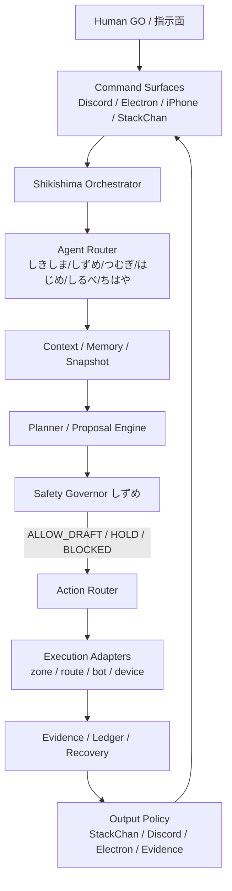

# しきしま完全自律運用 — 統合設計書（精査済み・次Burn-in前）

Date: 2026-05-28（StackChan voice PASS 反映）  
Status: **REVIEWED FOR BURN-IN PREP**  
親文書: `SHIKISHIMA_FULL_AUTONOMOUS_OPERATION_DESIGN.md`（2026-05-28 確定版を統合・現状反映）

---

## 0. 本書の目的

```text
「完全自律運用（Shikishima Full Autonomous Operation）」に至るまでの
設計・フェーズ・完了条件・安全境界・実装状況を 1 冊にまとめ、人間精査用とする。

本書は実行承認書ではない。productionReady / execution の変更は含まない。
```

### 読み方

| 章 | 精査の焦点 |
|----|------------|
| 1 | ゴール定義が合っているか |
| 2 | 現在地と方針（StackChan voice PASS 後） |
| 3–4 | アーキテクチャ・エージェント役割 |
| 5 | Phase 0–10 の順序と完了条件 |
| 6 | ゴール完了規約（/goal） |
| 7 | 安全・外部効果 |
| 8 | コードとドキュメントの対応 |
| 9 | 最終受け入れ（Phase 10） |
| 10 | 精査チェックリスト |

---

## 1. 最終ゴール定義

### 1.1 一行定義

```text
完全自律 = しきしまが「観測・理解・計画・安全判定・許可範囲の実行・証跡・復旧」を
           統合して運用できる状態。

StackChan = 身体 / 家側 AP（単独自律の主語ではない）
Human     = 高リスクの最終 GO
```

### 1.2 完成時に満たす 10 領域

| # | 領域 | 完成条件（要約） |
|---|------|------------------|
| 1 | 状態観測 | repo / queue / device / Discord / UI を安全に読める |
| 2 | 文脈理解 | 目的・HOLD 理由・次の安全な一手を説明できる |
| 3 | 計画 | Rally / GO 文面 / 次ゴールを自動生成（実行は分離） |
| 4 | 安全判定 | 全 action を分類し、しずめ HOLD は上書き不可 |
| 5 | 実行 | **許可済み low-risk のみ**自律実行 |
| 6 | Human GO | high-risk は必ず人間へ |
| 7 | StackChan | 顔・声・motion で通知（guarded 経路） |
| 8 | Discord 等 | draft / one-shot / 実送信の分離 |
| 9 | 証跡 | decision / action / result / recovery を記録 |
| 10 | 長時間 | burn-in 合格（暴走・raw 漏れ・無限 retry なし） |

### 1.3 不変条件（全 Phase・完成後も別承認まで）

```text
productionReady:        false
execution:            disabled
rawValuesReported:    false
retry_loop:           false（既定）
git push:               Human GO
discord send:           Human GO（one-shot 除く）
obsidian actual write:  HOLD
financial / firmware / mic常時 / camera: Human GO または BLOCKED
```

**禁止表現**: 検証済みと言い切る場合はテスト実行を明記すること。「問題ありません」は使わない。

---

## 2. 現在地（2026-05-28）

### 2.1 戦略ピボット

```text
StackChan voice pilot: PASS（connected:true + 人間可聴 PASS）
StackChan production / Discord voice bridge: HOLD（別GO）
優先: Burn-in → Acceptance → Discord one-shot（必要時）
```

参照: `STACKCHAN_VOICE_PILOT_ACCEPTANCE_2026-05-28.md`, `STACKCHAN_RESUME_NEXT_STEPS.md`

### 2.2 進捗概算

| 領域 | 進捗（概算） | 備考 |
|------|-------------|------|
| 設計パッケージ（Phase 0） | **100%** | 統一設計 MD 群 |
| 安全 / Gate アーキ | **60–70%** | zone + route guards |
| StackChan 身体 I/O | **70–75%** | Display ACCEPTED; Motion PASS; Voice pilot PASS |
| 司令塔コード（Phase 2–7） | **初版 DONE** | 下記 §8 |
| 外部効果の実実行 | **HOLD** | dry-run のみ |
| Burn-in（Phase 9） | **~15%** | モニタ初版 + 実時間 run 待ち |
| Level 8 完全自律 | **未達** | 目標 |

### 2.3 既に PASS / ACCEPTED の物理・表示

| 項目 | 状態 |
|------|------|
| Display-only 実運用 | **ACCEPTED** |
| Motion one-shot + 人間目視 | **PASS** |
| Voice readiness（VOICEVOX） | **PASS** |
| Voice pilot / acceptance | **PASS**（2026-05-28 人間可聴） |

---

## 3. 統一アーキテクチャ

### 3.1 データフロー



### 3.2 音声の正しい経路（再確認）

```text
❌ Hermes Worker が TTS バイナリを生成して端末へ送る
✅ しきしまが intent/phraseId を決定
   → PC 上 VOICEVOX → WebSocket PCM → StackChan ファームウェア

参照: STACKCHAN_VOICE_OUTPUT_ARCHITECTURE.md
本番厚い経路: scripts/shikishima-stackchan.mjs stackchanSay
パイロット guarded: stackchan-voice-production-speak（stackchanSay 同等プロトコル）
```

---

## 4. エージェント役割（変更なし）

| Agent | 役割 | 完全自律での禁止 |
|-------|------|------------------|
| **しきしま** | 司令塔・窓口・出力先選択 | しずめ HOLD の上書き |
| **しずめ** | 安全判定・cooldown・raw 防止 | — |
| **つむぎ** | 実装・Worker | GO なし push/runtime/device |
| **はじめ** | 計画・roadmap・/goal | — |
| **しるべ** | 証跡・ledger・handoff | — |
| **ちはや** | 市場・FX 専任 | 注文・口座操作 |
| **StackChan** | 身体・声・顔 | 単独で外部送信・push・retry |

---

## 5. Phase ロードマップ（0–10）

完了は **ゴール単位**（セクション完了ではない）。  
Registry: `FULL_AUTONOMY_GOAL_REGISTRY.md`

### Phase 0 — 設計固定

| 項目 | 内容 |
|------|------|
| 目的 | 完全自律の統一語彙・安全・ロードマップの固定 |
| 状態 | **DONE** |
| 成果物 | `SHIKISHIMA_FULL_AUTONOMOUS_OPERATION_DESIGN.md` ほかパッケージ |

### Phase 1 — Voice Completion（pilot PASS）

| 項目 | 内容 |
|------|------|
| 目的 | guarded 音声 one-shot の人間可聴 PASS |
| 状態 | **PASS（pilot scope）** |
| 証跡 | `STACKCHAN_VOICE_PILOT_ACCEPTANCE_2026-05-28.md` |
| 残HOLD | Discord / SideBot / production voice automation は別GO |
| コード | `stackchan-voice-route/*` |

### Phase 2 — Unified State Snapshot

| 項目 | 内容 |
|------|------|
| 目的 | 全サーフェスで同一 HOLD 理由を説明可能にする |
| 完了条件 | `ShikishimaUnifiedStateSnapshot` + 台帳接続 |
| 状態 | **コード初版 DONE**（精査・採用待ち） |
| コード | `snapshot-types.ts`, `build-unified-snapshot.ts`, `ledger-snapshot-bridge.ts` |

### Phase 3 — Unified Output Policy

| 項目 | 内容 |
|------|------|
| 目的 | StackChan=短 / Discord=確認 / Electron=詳細 / Evidence=完全 |
| 状態 | **コード初版 DONE** |
| コード | `unified-output-policy.ts`, `output-policy-integration.ts` |

### Phase 4 — Autonomous Proposal Engine

| 項目 | 内容 |
|------|------|
| 目的 | next rally + GO draft；**実行はしない** |
| 状態 | **コード初版 DONE** |
| コード | `proposal-engine.ts`, `proposal-registry-bridge.ts`, `goal-registry.ts` |

### Phase 5 — Controlled Local Autonomous Work

| 項目 | 内容 |
|------|------|
| 目的 | docs/types/tests/ledger を bounded scope で自走 |
| 状態 | **dry-run DONE**；実 write は zone + GO |
| コード | `local-autonomous-work.ts`, `local-work-dry-run.ts` |
| 境界 | `docs/shikishima/`, `autonomy-zone/`, `tests/hermes/zone/` 等 |

### Phase 6 — External Action Controlled Autonomy

| 項目 | 内容 |
|------|------|
| 目的 | read/write・draft/send・dry/actual 分離；事後 HOLD |
| 状態 | **registry + dry-run DONE**；実送信 HOLD |
| コード | `external-effect-registry.ts`, `evaluate-external-effect.ts`, `external-effects-dry-run.ts` |
| 参照 | `FULL_AUTONOMY_EXTERNAL_EFFECT_REGISTRY.md` |

### Phase 7 — Secretary Mode（プランナー）

| 項目 | 内容 |
|------|------|
| 目的 | 家側 AP として GO 確認・状態報告の**計画** |
| 状態 | **planner-only DONE**；Discord/音声配線なし |
| 将来 | Discord 文 → しきしま → guarded voice（Phase 1+6 後） |
| コード | `secretary-mode.ts`, `secretary-planner-only.ts` |
| 参照 | `SHIKISHIMA_DISCORD_STACKCHAN_VOICE_FUTURE_DESIGN.md` |

### Phase 8 — Scheduler / Recovery

| 項目 | 内容 |
|------|------|
| 目的 | cooldown, max_attempts, degraded, manual override |
| 状態 | **コード初版 DONE**（`scheduler-recovery.ts`） |
| 未実装 | 常駐 daemon / Electron 統合 |

### Phase 9 — Limited Burn-in

| 項目 | 内容 |
|------|------|
| 目的 | 2h / 6h / 24h / 3-day 候補で暴走・漏れ・無承認 write なし |
| 状態 | **モニタ初版 DONE**（`burn-in-monitor.ts`） |
| 成果物（予定） | `FULL_AUTONOMY_BURN_IN_EVIDENCE.md`（実時間 run は別 GO） |

### Phase 10 — Full Autonomous Operation Acceptance

| 項目 | 内容 |
|------|------|
| 目的 | Level 8 到達の正式判定 |
| 状態 | **評価器 DONE**（`acceptance-matrix.ts`） |
| 成果物（予定） | `FULL_AUTONOMY_OPERATION_ACCEPTANCE.md`, `FULL_AUTONOMY_SAFETY_REVIEW.md` |

### オーケストレータ（Phase 2–10 一括）

```typescript
import { runFullAutonomyPipeline } from "src/main/shikishima-full-autonomy";
runFullAutonomyPipeline({
  voicePass: true,
  stackchanConnected: true,
  stackchanDeferred: false
});
```

---

## 6. ゴール完了規約

### 6.1 /goal と /goalmacro

```text
/goal      = 完了定義（Done Criteria・証跡・テスト）
/goalmacro = 実行手順（Composer 用）
同一 goal-id で揃える（例: shikishima.phase2.unified-state-snapshot）
```

テンプレート: `FULL_AUTONOMY_GOAL_DEFINITION.md`

### 6.2 完了 vs HOLD vs STOP

| Status | 条件 |
|--------|------|
| **COMPLETED** | Done Criteria 全て + 検証実行済み + ledger 更新 |
| **HOLD** | 環境・GO・目視・接続・VOICEVOX 等 |
| **STOP** | 安全違反・禁止領域・raw 漏れ |

### 6.3 Autonomy Level（目標 Level 8）

| Level | 名称 | 要点 |
|------:|------|------|
| 0–1 | Manual / One-shot | 窓 GO・単発 |
| 2–4 | Draft / Read / Local | 自走 docs・types・tests |
| 5–6 | External controlled | 実外部効果は GO |
| 7 | Secretary | StackChan 出力統合 |
| **8** | **Full Operation** | **本設計のゴール** |

詳細: `FULL_AUTONOMY_LEVEL_MATRIX.md`

---

## 7. 安全・外部効果・しずめ

### 7.1 判定フロー（目標）

```text
Intent → Preflight → classifyAction → evaluateRisk
  → requireHumanGo? → NEEDS_HUMAN（実行しない）
  → BLOCKED? → STOP
  → allowed → Adapter → Evidence → restoreHold
```

### 7.2 外部効果レジストリ（抜粋）

| route_id | 既定 | human_go | 備考 |
|----------|------|----------|------|
| stackchan.display/motion/voice | HOLD | yes | one-shot |
| discord.read | HOLD | yes | |
| discord.send | HOLD | yes | one-shot |
| git.push | HOLD | yes | |
| production.ready | BLOCKED | yes | |
| financial / firmware / mic | BLOCKED | yes | |

全文: `FULL_AUTONOMY_EXTERNAL_EFFECT_REGISTRY.md`

### 7.3 既存コードとの対応

| 層 | 実装 |
|----|------|
| Zone | `src/main/ichikishima/autonomy-zone/` |
| StackChan route | `stackchan-*-route/`, `evaluateStackChanActiveControlRoute` |
| Full autonomy | `src/main/shikishima-full-autonomy/` |
| しきしま core gate | `src/main/shikishima-core/` |

---

## 8. 実装マップ（精査用）

### 8.1 しきしま完全自律（司令塔）

```text
src/main/shikishima-full-autonomy/
  autonomy-invariants.ts        # Ch.1 不変条件
  autonomy-level.ts               # Ch.6 Level 0–8
  classify-action.ts            # Ch.7 分類
  integrated-safety-pipeline.ts   # Ch.7 統合パイプライン
  goal-registry.ts              # Phase 4 + 8–10 goals
  ledger-snapshot-bridge.ts     # Phase 2
  output-policy-integration.ts  # Phase 3
  proposal-registry-bridge.ts   # Phase 4
  local-work-dry-run.ts         # Phase 5
  external-effects-dry-run.ts   # Phase 6
  external-effect-registry.ts   # Ch.7 全 route
  secretary-planner-only.ts     # Phase 7
  scheduler-recovery.ts         # Phase 8
  burn-in-monitor.ts            # Phase 9
  acceptance-matrix.ts          # Phase 10 FA-01..12
  goal-completion-validator.ts  # Ch.6 /goal
  design-review-checklist.ts    # Ch.11 自動
  gap-tracker.ts                # Ch.10 G1–G7
  run-full-autonomy-cycle.ts    # Phase 2–7
  run-full-autonomy-pipeline.ts # Phase 2–10 一括
  safety-governor.ts
```

テスト: `tests/hermes/zone/full-autonomy/`（2026-05-26 拡張）

エントリ:

```typescript
import { runFullAutonomyPipeline } from "src/main/shikishima-full-autonomy";
runFullAutonomyPipeline({
  voicePass: true,
  stackchanConnected: true,
  stackchanDeferred: false
});
```

### 8.2 StackChan（身体・pilot PASS）

```text
src/main/stackchan-display-route/   # ACCEPTED 系
src/main/stackchan-motion-route/    # PASS 系
src/main/stackchan-voice-route/     # pilot PASS / production HOLD
scripts/shikishima-stackchan.mjs    # 本番 stackchanSay
docs/firmware/shikishima_cores3/    # PCM / WS（audio.state は要フラッシュ）
```

### 8.3 Hermes Desktop 起動時の注意

```text
SHIKISHIMA_SHADOW_MODE = true  → STT/イベントサーバ HOLD
SIDEBOT_HOLD = true            → Discord bot 自動起動 HOLD
stackchan-say IPC              → ドラフトのみ（実送信なし）

→ 「Hermes 起動」だけでは音声は流れない。接続確認が先。
参照: VOICE_PILOT_STARTUP_CHECKLIST.md
```

---

## 9. 最終受け入れ（Phase 10）

### 9.1 Acceptance Matrix（更新案）

| ID | 基準 | 状態（2026-05-28） |
|----|------|-------------------|
| FA-01 | 統一設計固定 | PASS |
| FA-02 | 自走運用 doc | PASS |
| FA-03 | Display ACCEPTED | PASS |
| FA-04 | Motion PASS | PASS |
| FA-05 | Voice audible PASS | **PASS** |
| FA-06 | External effect registry | PASS（doc+code） |
| FA-07 | Safety governor | **PARTIAL** |
| FA-08 | Unified snapshot | **PARTIAL**（code v1） |
| FA-09 | Output policy | **PARTIAL**（code v1） |
| FA-10 | Proposal engine | **PARTIAL**（code v1） |
| FA-11 | Burn-in | TODO |
| FA-12 | Full operation acceptance | TODO |

### 9.2 Level 8 = ACCEPTED の条件

```text
1. FA-01 .. FA-12 がすべて PASS
2. Burn-in 証跡が Human 受理
3. 未解消 STOP なし
4. productionReady / execution は別文書で明示承認まで false/disabled
```

---

## 10. 残ギャップ・リスク（精査向け）

| # | ギャップ | 影響 | 想定対応 |
|---|----------|------|----------|
| G1 | Voice / StackChan 接続 | pilot scope 完了 | CLOSED（production/Discordは別GO） |
| G2 | Phase 8–9 未実装 | 長時間運用未証明 | Scheduler + burn-in |
| G3 | 実 execution 層 | Level 8 の「許可実行」 | zone 拡張 + 各 GO |
| G4 | SideBot / Shadow HOLD | 本番 Discord 経路と乖離 | 別 GO で段階解除 |
| G5 | Obsidian 実 write | 台帳の外部同期 | 別 GO |
| G6 | FA-07 governor 統合 | スナップショットと一本化 | Phase 8 前後 |
| G7 | ファーム audio.state / pcmBuf.clear | 診断性・音質 | FW フラッシュ（任意・別GO） |

### 推定 Rally（変更なし・参考）

```text
最短 52 / 標準 65–75 / 堅牢 90+ Rally
（SHIKISHIMA_FULL_AUTONOMOUS_OPERATION_DESIGN.md §8 より）
```

---

## 11. 精査チェックリスト

### 11.1 ゴール定義

- [ ] 「完全自律」の主語はしきしまでよいか
- [ ] StackChan を身体に留める定義でよいか
- [ ] Level 8 を最終到達点としてよいか

### 11.2 Phase 順序

- [x] Phase 1 voice pilot PASS を Phase 2–10 に反映してよいか（2026-05-28 反映）
- [ ] Phase 7 を planner-only に留めることでよいか
- [ ] Phase 8–10 の順序（Scheduler → Burn-in → Acceptance）でよいか

### 11.3 安全

- [ ] 不変条件（§1.3）に不足はないか
- [ ] 外部効果レジストリに漏れ route はないか
- [ ] Human GO が必要な操作がすべて列挙されているか

### 11.4 実装と設計の一致

- [ ] Phase 2–7 コードが設計意図と一致しているか
- [ ] 音声 Hermes 非経由が維持されているか
- [ ] dry-run のみで Level 4–6 を「完了」と呼ばない運用でよいか

### 11.5 受け入れ

- [ ] FA-08–10 を PARTIAL のまま精査通過とするか、Done Criteria を足すか
- [ ] Burn-in の長さ（2h/6h/24h/3d）でよいか

---

## 12. 関連ドキュメント索引

| 用途 | ファイル |
|------|----------|
| 確定版総論 | `SHIKISHIMA_FULL_AUTONOMOUS_OPERATION_DESIGN.md` |
| Cursor 自走 | `SHIKISHIMA_AUTONOMOUS_SELF_RUN_OPERATIONS.md` |
| ロードマップ | `FULL_AUTONOMY_ROADMAP.md` |
| ゴール一覧 | `FULL_AUTONOMY_GOAL_REGISTRY.md` |
| 台帳 | `AUTONOMY_GOAL_LEDGER.md` |
| StackChan 後回し | `FULL_AUTONOMY_STACKCHAN_DEFERRED.md` |
| Phase 2–7 証跡 | `PHASES_2_7_INTEGRATION_EVIDENCE.md` |
| 音声アーキ | `STACKCHAN_VOICE_OUTPUT_ARCHITECTURE.md` |
| Codex 整合レビュー | `STACKCHAN_VOICE_CODEX_DESIGN_ALIGNMENT_REVIEW.md` |
| Voice pilot PASS | `STACKCHAN_VOICE_PILOT_ACCEPTANCE_2026-05-28.md` |
| StackChan 再開後ステップ | `STACKCHAN_RESUME_NEXT_STEPS.md` |
| 安全 | `FULL_AUTONOMY_SAFETY_GOVERNOR_SPEC.md` |
| 受け入れ | `FULL_AUTONOMY_ACCEPTANCE_MATRIX.md` |
| /goal 規約 | `FULL_AUTONOMY_GOAL_DEFINITION.md` |

---

## 13. 精査後の想定アクション

```text
1. 本書へのコメント・修正指示
2. Burn-in 計画の承認（2h / 6h / 24h / 3d）
3. FA-08–10 の Done Criteria 確定（コード v1 を COMPLETED にするか）
4. Discord one-shot / SideBot / production voice の個別GO判断
5. Firmware flash（audio.state 診断）の要否判断
```

---

## 変更履歴

| Date | 変更 |
|------|------|
| 2026-05-26 | 初版。Phase 2–7 コード統合・StackChan DEFERRED を反映 |
| 2026-05-28 | StackChan voice pilot PASS、FA-05 PASS、G1 CLOSED、Burn-in前精査へ更新 |
