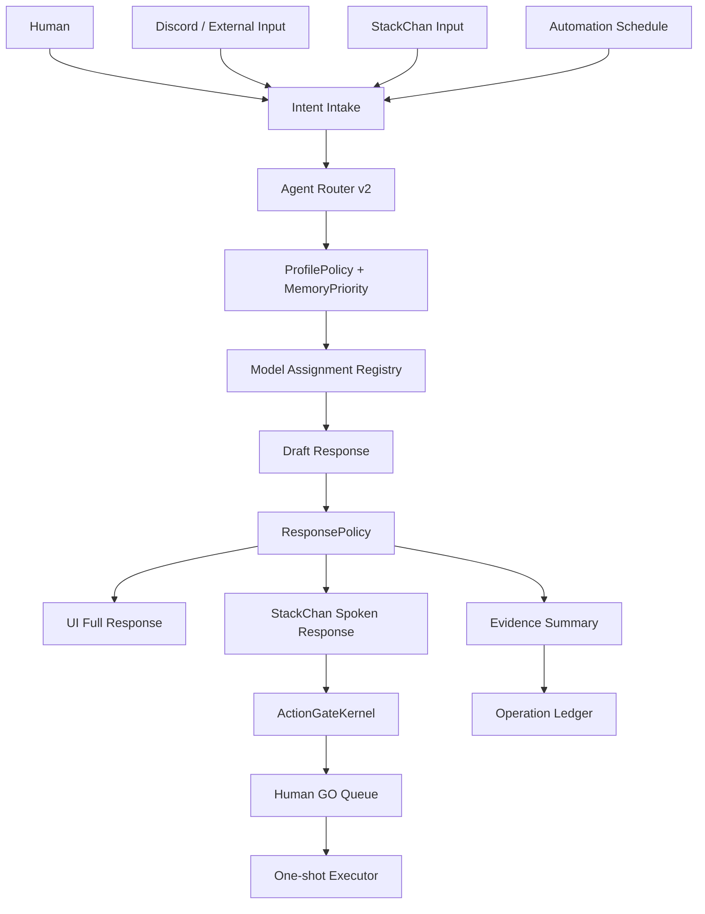

# Shikishima Future Implementation Master Design — 2026-05-24

## Result

```text
status: PREIMPLEMENTATION_DESIGN_COMPLETE
scope: Shikishima agent rebuild / StackChan response / profile / automation / realtime / FX / debate mode
implementation_started: false
runtime_started: false
external_action_performed: false
stackchan_controlled: false
productionReady: false
execution: disabled
rawValuesReported: false
git_push_performed: false
```

## Purpose

今後の全実装を、場当たり的な機能追加ではなく、次の中核設計へ整理する。

主な課題:

- それぞれのエージェントに割り当てる AI / worker の整合性
- StackChan に回答を飛ばす際のレスポンス品質、長さ、推論レベル
- プロフィール固定化と「発してほしくない」と伝えても改善されない原因
- 自律開発、記録、オートメーションの正確さ
- リアルタイム発信・取得の整合性
- FX 関連の優位性、方向性、AI が考えるポジション保有判断
- エージェントごとの討論モード

## Current Diagnosis

### A. AI assignment is split across multiple places

現状では AI / worker 割り当てが複数箇所に分散している。

Observed paths:

- agent definitions
- agent router
- persona prompts
- skill registry
- sidebot
- renderer chat path
- StackChan speech path
- research pipeline

Problem:

```text
同じ「しきしま」でも、UI会話、Discord、StackChan、研究、FX、sidebot で
違うモデル・違う人格・違う安全境界になる可能性がある。
```

### B. StackChan speech is downstream of chat, not a first-class response policy

Renderer chat currently can call model response and then send the full reply to StackChan speech.

Problem:

```text
画面で読む文章と、StackChanが声に出す文章が分離されていない。
長文・秘密情報・未整形のエラー文・重い推論結果がそのまま発話候補になる。
```

Required separation:

```text
full_response: UI/log用
spoken_response: StackChan発話用の短文
speech_policy: 発話可否・長さ・安全ラベル
```

### C. Profile correction does not reliably propagate

「発してほしくない」と伝えても改善されない原因候補:

1. Persistent context / long-term memory に古いプロフィールや固定設定が焼き込まれている。
2. Persona prompt と memory context が別々に組み立てられ、更新優先順位がない。
3. StackChan speech path が最終発話用フィルタを通っていない。
4. agent-router / sidebot / Grok chat / Discord / StackChan が別経路で人格を作る。
5. 短期会話履歴が小さく切られるため、直前の「それは言わないで」が後続モデルに届かない。
6. ソース内の一部日本語が文字化けしており、人格・制約がモデルに正しく伝わらない可能性がある。

Conclusion:

```text
プロフィールは「プロンプトの一部」ではなく、ProfilePolicy と MemoryPriority と SpeechFilter に分離する必要がある。
```

### D. Automation and records are not yet one ledger

自律開発・記録・オートメーションは進んでいるが、現状は次のように分散している。

- docs evidence
- sidebot logs
- memory network
- Discord logs
- Obsidian writes
- research pipeline output
- StackChan event logs

Problem:

```text
どのAIが、どのGOで、何を実行し、何を記録し、どのGateへ戻したかが
一つの台帳として追えない。
```

### E. Realtime input/output modes are mixed

Realtime と呼べる経路:

- Discord receive/send
- Grok/Hermes x_search
- StackChan STT/audio/event/camera
- scheduled research
- sidebot loop
- FX watcher / market analysis

Problem:

```text
read-only, draft, external write, physical/device output, scheduled automation が同じ実行面に近い。
```

### F. FX module needs decision-class separation

FX は「分析」と「ポジション判断」と「実売買」は別物。

Required split:

```text
market_observation: 情報取得
trade_thesis: 売買仮説
risk_check: lot / DD / SL / invalidation
position_intent: AIが考える方向性
trade_execution: HARD HOLD
```

AI はポジション案を考えてよいが、実行判断は人間。

### G. Debate mode is missing as a controlled workflow

複数エージェントは存在するが、討論・反論・合意形成の正式プロトコルがない。

Required:

```text
proposal -> agent arguments -> safety challenge -> evidence check -> synthesis -> human decision
```

## Target System Overview



## Canonical Implementation Pillars

### 1. Model Assignment Registry

Create one canonical registry for all agent/model routing.

Fields:

```text
agent_id
role
default_model
fallback_models
allowed_capabilities
forbidden_capabilities
max_reasoning_level
realtime_allowed
external_write_allowed
stackchan_speech_allowed
fx_position_allowed
requires_human_go_for
```

Required rule:

```text
No code path may choose a model without consulting the registry.
```

Recommended initial assignment:

```text
shikishima:
  role: control / synthesis / user-facing answer
  model: stable general model
  max_reasoning_level: medium
  stackchan_speech_allowed: draft only until gate

shizume:
  role: safety / GO-HOLD / policy
  model: high precision model
  max_reasoning_level: high
  external_write_allowed: false

tsumugi:
  role: implementation / code / worker routing
  model: ClaudeCode for Shikishima core, Codex for StackChan/review
  max_reasoning_level: high
  direct_execution_allowed: false without gate

hajime:
  role: planning / task breakdown
  model: planning-heavy model
  max_reasoning_level: high

shirube:
  role: record / research / evidence
  model: research model for read-only, lightweight model for logging
  external_write_allowed: false without Obsidian/Discord GO

chihaya:
  role: FX observation / thesis / risk
  model: realtime-capable research model
  trade_execution_allowed: false
```

### 2. ProfilePolicy

Profile must become a typed policy, not loose prompt text.

Fields:

```text
identity_profile
speaking_style
forbidden_phrases
forbidden_topics
required_disclaimers
stackchan_speech_style
discord_reply_style
fx_style
last_user_corrections
priority
updated_at
```

Priority order:

```text
1. hard safety policy
2. current human correction
3. explicit profile settings
4. long-term memory
5. persona flavor
6. model default behavior
```

Fix for "do not say this" issue:

```text
Store user correction as ProfilePolicy.last_user_corrections.
Apply it after memory and persona.
Run final response through ProfileComplianceCheck.
Run StackChan spoken text through SpeechFilter.
```

### 3. ResponsePolicy for StackChan

StackChan must not receive raw full answers.

Response schema:

```text
response_id
agent_id
full_response
spoken_response
spoken_allowed
reasoning_level_label
emotion
voice_speed
max_speech_chars
requires_human_go
redaction_passed
profile_compliance_passed
```

Recommended speech limits:

```text
normal: 40-80 Japanese characters
status: 20-50 Japanese characters
error: do not speak raw errors
FX: no trade instruction speech without human confirmation
```

Reasoning level labels:

```text
quick: simple response
standard: normal synthesis
deep: multi-agent / evidence-required
critical: shizume review + human GO required
```

Important:

```text
Do not expose chain-of-thought.
Expose only reasoning_level_label and short rationale.
```

### 4. Operation Ledger

Every automation or external action needs one ledger record.

Fields:

```text
operation_id
source
agent_id
model_id
gate_id
human_go_ticket
action_kind
input_summary
output_summary
external_write
device_action
runtime_started
run_count
gate_restored_hold
evidence_file
```

Use it for:

- autonomous development
- evidence creation
- Discord read/send
- Obsidian write
- x_search
- StackChan speech/motion/camera
- FX thesis generation
- debate mode

### 5. Automation Contract

Automation must be declared before it runs.

Required:

```text
automation_id
schedule
purpose
allowed_actions
forbidden_actions
max_run_count
max_duration
read_only_or_write
gate_required
evidence_path
stop_conditions
```

Default:

```text
scheduled external read/write: HOLD
background daemon: HOLD
retry loop: HOLD
one-shot local draft: allowed
```

### 6. Realtime Consistency Layer

Realtime sources must be classified.

```text
READ_ONLY:
  x_search
  Discord read
  market data observation

DRAFT:
  reply draft
  StackChan speech draft
  FX thesis draft

ONE_SHOT_EXTERNAL:
  Discord send
  StackChan speak once
  Obsidian write

CONTINUOUS:
  STT loop
  camera monitoring
  scheduled social/news watcher

HARD_HOLD:
  autonomous posting
  autonomous trading
  continuous camera/mic
```

### 7. FX Agent Design

Chihaya should produce structured outputs only.

FX output schema:

```text
market_context
direction_bias: long / short / neutral / wait
setup_name
entry_zone
invalidation
risk_notes
confidence_label
evidence_sources
what_would_change_my_mind
position_intent
trade_execution: false
```

Rules:

```text
AI may suggest a thesis.
AI may say wait.
AI may calculate risk.
AI may not place trades.
AI may not imply guaranteed edge.
AI must separate observation from recommendation.
```

### 8. Debate Mode

Create a structured agent debate workflow.

Modes:

```text
design_debate
safety_debate
fx_debate
implementation_debate
stackchan_debate
```

Debate protocol:

```text
1. proposer: states plan
2. hajime: decomposes plan
3. tsumugi: implementation feasibility
4. shizume: risk and STOP conditions
5. shirube: evidence and history check
6. chihaya: FX-specific view if relevant
7. shikishima: synthesis
8. human: GO / HOLD / REJECT
```

Debate output:

```text
proposal
agent_positions
conflicts
resolved_points
unresolved_points
risk_level
recommended_next_action
human_decision_required
```

## Implementation Phases

### Phase A — Stabilize and Centralize

Goal:

```text
Make all paths consult the same model/profile/gate source.
```

Tasks:

1. Add Model Assignment Registry.
2. Add ProfilePolicy model.
3. Add ResponsePolicy schema.
4. Add Operation Ledger schema.
5. Add tests for default HOLD.

### Phase B — StackChan Speech Safety

Goal:

```text
StackChan speaks only curated spoken_response, never raw full_response.
```

Tasks:

1. Split UI response from spoken response.
2. Add SpeechFilter.
3. Add max character limits.
4. Add emotion mapping.
5. Require Human GO for actual speech until final approval.

### Phase C — Profile Correction Reliability

Goal:

```text
When user says "do not say X", the system stops saying X across all paths.
```

Tasks:

1. Add profile correction command.
2. Store correction in ProfilePolicy.
3. Apply correction after memory/persona.
4. Add compliance checker.
5. Add tests with forbidden phrase examples.

### Phase D — Automation and Ledger

Goal:

```text
Every autonomous or scheduled action is traceable.
```

Tasks:

1. Add Operation Ledger writer.
2. Add automation declarations.
3. Convert sidebot and research pipeline to declared automations.
4. Add gate restored HOLD checks.

### Phase E — Realtime Gate Unification

Goal:

```text
Realtime read/write/device paths are consistently classified.
```

Tasks:

1. Add realtime source registry.
2. Gate continuous sources.
3. Add one-shot windows.
4. Add privacy checks for camera/audio.

### Phase F — FX and Debate Mode

Goal:

```text
Make FX output useful without pretending to execute trades.
Make multi-agent disagreement visible.
```

Tasks:

1. Add Chihaya FX schema.
2. Add no-trade-execution guard.
3. Add Debate Session model.
4. Add Agent Theater debate view.

## Tests Required Before Implementation Is Accepted

```text
model_assignment_registry_has_all_agents
no_agent_has_unbounded_external_write
profile_correction_overrides_long_term_memory
stackchan_spoken_response_is_short_and_redacted
raw_full_response_not_sent_to_stackchan
operation_ledger_required_for_external_action
automation_requires_contract
realtime_continuous_sources_hold_by_default
fx_output_has_trade_execution_false
debate_mode_requires_human_final_decision
productionReady_remains_false
execution_remains_disabled
rawValuesReported_remains_false
```

## Recommended Next Task

Next implementation should be:

```text
Task: Add Model Assignment Registry + ProfilePolicy + ResponsePolicy types
Worker: ClaudeCode
Scope: source model/types + tests only
Forbidden: runtime, StackChan action, external API, Discord send, Obsidian write, productionReady true, execution enabled
```

Do not start by changing live StackChan or Discord behavior.
First create the canonical registry and policy objects, then wire them one path at a time.
