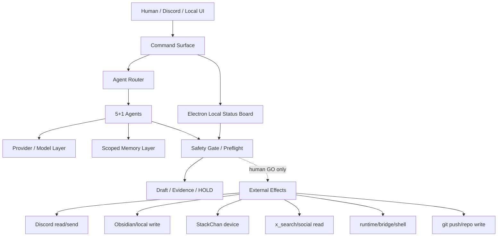

# しきしまエージェント — 内部設計全体概要

## 0. 文書の目的と安全境界

この文書は、しきしまエージェントの内部設計を GPT / 外部レビュアーへ渡すための設計審査資料である。
対象は Shikishima Desktop / Hermes Desktop の全体アーキテクチャ、安全ゲート、外部操作経路、現在の設計上の穴、デバッグ準備である。

この文書は実行承認ではない。

```text
git_push: NOT_APPROVED
runtime_start: NOT_APPROVED
Discord_send: HOLD
Obsidian_write: HOLD
StackChan_connection: HOLD
external_API_write: HOLD
productionReady: false
execution: disabled
rawValuesReported: false
```

StackChan は本書では一旦 HOLD として扱う。StackChan firmware / motion / voice / STT / camera / network device operation は、別 GO があるまで進めない。

---

## 1. 現在の検証済みGit状態

### 1.1 作業前状態

前回の `SYSTEM_DESIGN_OVERVIEW.md` 作成前に確認された状態:

```text
before_this_doc:
  branch: main
  HEAD: 6a317730c441ae7f97273edda88ba57e944622b2
  origin/main: 8ee65fb5c2297536ce17dc5f9071e50165f11c34
  commits_ahead: 5
  staged: 0
  tracked_dirty: 0
```

### 1.2 この文書作成後の状態

前回の設計書 commit 後、今回の修復前に確認された状態:

```text
after_previous_commit:
  branch: main
  HEAD: 8df19990650d553fb0d7baf42655acbd7818e0fc
  origin/main: 8ee65fb5c2297536ce17dc5f9071e50165f11c34
  commits_ahead: 6
  staged: 0
  tracked_dirty: 0
  latest_commit: 8df1999 docs: finalize shikishima system design overview
```

この修復 task が commit を作成した場合、commit 自身の hash は文書内容へ事前固定できない。
そのため、修復 commit の正確な hash は task final report と `git log -1` を canonical source とする。

```text
after_repair_commit:
  expected_commits_ahead: 7
  exact_HEAD: see final report / git log -1
```

### 1.3 origin/main..HEAD ローカルコミット一覧

今回の修復前に存在した local commits:

```text
8df1999 docs: finalize shikishima system design overview
6a31773 feat: add stackchan sleepy screen sway
326ddce docs: record secretary guard dry run evidence
794493c docs: record secretary routine dry run evidence
45631c7 docs: record secretary v1 acceptance candidate
2c19660 docs: summarize secretary remaining work
```

注意:

```text
roadmapVersion: v4.40.0系を基準。
ただし local HEAD は origin/main より複数コミット先行しており、
pushPending / Gate 004 表記は最新ローカル状態と不一致の可能性がある。
```

---

## 2. プロジェクト概要

しきしまデスクトップは、Electron + TypeScript 製の AI 安全コントロールセンターである。

主な目的:

- AI エージェントの自律開発、記録、外部連携を段階的に扱う。
- 外部操作は `HOLD` を初期状態とし、人間の明示 GO なしでは実行しない。
- Discord / Obsidian / StackChan / Hermes / x_search / GitHub push / productionReady / execution enabled を gate で分離する。
- 「作る」「確認する」「記録する」と、「外へ送る」「動かす」「本番化する」を明確に分ける。

現在の中心課題:

- Discord-first の実運用に合わせた設計整理。
- Electron 側の位置づけを Local Status Board / Safety Monitor として再定義。
- agent / provider / model / memory / persona / safety decision を追跡可能にする Model Trace の導入。
- StackChan は一旦 HOLD に戻し、しきしま本体設計を先に整理する。

---

## 3. 技術スタック

| 領域 | 技術 | 用途 |
|---|---|---|
| Desktop shell | Electron | Windows desktop app |
| Main process | Node.js / TypeScript | IPC, gate, integrations |
| Renderer | React / TypeScript | UI, Agent Theater, status panels |
| Styling | Tailwind CSS | layout / dashboard |
| Persistence | JSON / better-sqlite3 | session, memory, local state |
| AI gateway | Hermes / Groq / Claude / Gemini / Grok | response generation / research |
| Hardware integration | StackChan CoreS3 | HOLD in this document |
| Docs / evidence | Markdown | gates, review, audit trail |

---

## 4. 現在の一次操作面: Discord-first 方針

実運用上、ユーザーが最も確認しやすい一次操作面は Discord に移っている。

```text
Discord:
  practical_primary_command_surface: true
  read: conditional / gate required
  send: HOLD

Electron:
  reclassified_as: Local Status Board / Safety Monitor
  role:
    - status snapshot
    - gate visibility
    - draft review
    - local debugging
    - emergency HOLD visibility
```

重要:

- Discord が一次操作面になっても、Discord send は HOLD のまま。
- Discord 上で見られることと、Discord へ自動送信することは別 gate。
- Electron は不要になったのではなく、外部操作の状態・証跡・安全境界を可視化する役割へ寄せる。

---

## 5. 全体アーキテクチャ



設計原則:

- Entry surface は複数でも、external effect は gate で一元管理する。
- Renderer / Discord / worker から直接外部効果を起こさない。
- すべての external effect は action mode と safety decision を持つ。

---

## 6. 5+1エージェントシステム

| Agent ID | 名前 | 主担当 | 現在の注意点 |
|---|---|---|---|
| `shikishima` | しきしま | 管制 / ユーザー窓口 | final decision と GO を混同しない |
| `shizume` | しずめ | safety / gate / STOP | Level 5 境界の最終確認 |
| `tsumugi` | つむぎ | implementation / worker task | ClaudeCode / Codex routing の明確化 |
| `hajime` | はじめ | planning / roadmap | 計画と実行承認を分離 |
| `shirube` | しるべ | record / evidence | evidence と実行結果を混同しない |
| `chihaya` | ちはや | FX / market analysis | financial action と analysis を分離 |

現在の課題:

- エージェントの AI 割当と fallback がユーザーから見えにくい。
- どの agent が、どの model で、どの記憶 profile を使って返答したか追えない。
- 討論モードでは「提案者」「反対者」「安全判定者」「最終 human GO」の責務を分離する必要がある。

---

## 7. AIモデル割当とModel Traceの課題

Current issue:

```text
The user cannot reliably confirm which agent, provider, model, fallback,
memory profile, persona profile, and safety decision produced a response.
```

これにより、以下の問題が起きる。

- StackChan への回答品質や推論レベルを後から検証できない。
- しきしま / つむぎ / しずめの責務がログ上で混ざる。
- fallback が起きた時に、想定より弱い model が回答したことに気づけない。
- safety decision が HOLD だったのか、単なる文面上の注意だったのか不明になる。

Required future schema:

```json
{
  "agentId": "tsumugi",
  "provider": "claude",
  "model": "claude-sonnet",
  "fallbackUsed": false,
  "routeReason": "implementation_request",
  "memoryProfile": "shikishima-development",
  "personaProfile": "tsumugi-dev",
  "sourceChannel": "discord",
  "safetyDecision": "HOLD",
  "actionMode": "draft_only"
}
```

推奨:

- 全応答に redacted Model Trace を付与できるようにする。
- Discord 表示では短縮 trace、Electron status board では詳細 trace。
- StackChan 発話時は trace を発話しないが、evidence へ残す。

---

## 8. 記憶システムとMemory Scopeの課題

現在の記憶は、長期記憶・中期記憶・短期文脈・persona / profile の複合で動く。

設計上の穴:

```text
FX / EA / propfirm / jobsearch memories must not be injected into
Shikishima development by default.
```

Default active profile:

```yaml
activeMemoryProfile: shikishima-development
activeNamespaces:
  - shikishima
  - discord-ops
  - codex
  - claude-code
blockedByDefault:
  - fx-trading
  - mql-ea
  - propfirm
  - jobsearch
```

必要な改善:

- task ごとに memory namespace を明示する。
- FX / EA / propfirm / jobsearch の記憶は opt-in にする。
- StackChan 秘書化では生活監視・秘書記憶を別 namespace にする。
- memory injection 結果を redacted snapshot として検証可能にする。

---

## 9. Persona反映と指示遵守の課題

Current issue:

```text
Persona is currently too prose-based and must become testable constraints.
```

ユーザーが「発してほしくない」と伝えても改善されない原因候補:

- persona が自然文の方針で、テスト可能な禁止ルールになっていない。
- persistent memory と user preference の優先順位が曖昧。
- StackChan 発話用の短縮・音声整形後に、phrase policy が再適用されていない。
- Discord 返信、Electron UI、StackChan speech で異なる prompt assembly が使われている可能性がある。

改善案:

- persona を `tone`, `allowed_phrases`, `blocked_phrases`, `required_checks` に分割。
- forbidden phrase test を追加。
- StackChan speech 前に `voiceSafePhrasePolicy` を通す。
- user correction を long-term memory ではなく preference policy として扱う。

---

## 10. Discord運用設計

Discord は実用上の一次操作面だが、write は HOLD。

| 操作 | 現在状態 | 備考 |
|---|---|---|
| Discord read | conditional | read-only GO / evidence 必須 |
| Discord draft | DRAFT_ONLY | 人間確認前提 |
| Discord send | SAFETY_HOLD | one-shot GO なしでは不可 |
| Discord auto-reply | NOT_APPROVED | retry loop / daemon 禁止 |
| Discord bot polling | SAFETY_HOLD | SHADOW_MODE / explicit runtime GO |

必要な安全条件:

- send count を証跡化。
- token をログに出さない。
- retry loop なし。
- gate restored HOLD を after-action verification に含める。
- Discord-first でも external write は人間 GO。

---

## 11. Obsidian / レポート出力設計

Obsidian / local report write は local write であり、無害なログではない。

| 操作 | 現在状態 | 必要 gate |
|---|---|---|
| report draft | DRAFT_ONLY | no external write |
| local markdown write | SAFETY_HOLD | OBS-LOCAL GO |
| Obsidian sync | NOT_APPROVED | separate cloud/sync GO |
| arbitrary path write | NOT_APPROVED | disallowed |

必要条件:

- vault path scope。
- target folder / filename rule。
- raw secret exclusion。
- dry-run と actual write の分離。
- write 後 evidence。

---

## 12. StackChan統合状態

StackChan は現在 HOLD。

```text
StackChan face/display: design or partial UI only
StackChan voice: HOLD
StackChan motion: HOLD
StackChan STT: HOLD
StackChan network/device connection: NOT_APPROVED unless separate GO
```

分類:

| 領域 | 状態 | 備考 |
|---|---|---|
| face/display | SAFETY_HOLD | design / partial firmware history exists |
| voice | SAFETY_HOLD | one-shot GO なしでは不可 |
| motion/dance | SAFETY_HOLD | 実機操作は別 GO |
| touch/pat sensor | SAFETY_HOLD | motion module と連動するため別 gate |
| STT / microphone | SAFETY_HOLD | privacy gate 必須 |
| camera | SAFETY_HOLD | one-shot / continuous を分離 |
| continuous monitoring | NOT_APPROVED | 秘書化 roadmap の後段 |

この文書では StackChan を再開しない。StackChan は、しきしま本体の設計審査が終わるまで一旦 HOLD とする。

---

## 13. Safety Gate / SHADOW_MODE / External Effect Registry

主要 invariant:

```text
productionReady: false
execution: disabled
rawValuesReported: false
SHADOW_MODE: true
decision_default: HOLD
human_go_required_for_level5: true
```

External Effect Registry:

| Route | Effect Type | Current Status | Safety Gate Required | Approved Now |
|---|---|---|---|---|
| Discord read | external_read | design/limited | yes | conditional |
| Discord send | external_write | HOLD | yes | no |
| Obsidian write | local_write | HOLD | yes | no |
| StackChan face | device_display | HOLD | yes | no |
| StackChan voice | device_audio | HOLD | yes | no |
| StackChan motion | device_motion | HOLD | yes | no |
| StackChan STT | mic/stt | HOLD | yes | no |
| GitHub push | repo_write | HOLD | yes | no |
| x_search | external_read | HOLD unless separate GO | yes | no |
| productionReady change | release_gate | NOT_APPROVED | yes | no |
| execution enablement | execution_gate | NOT_APPROVED | yes | no |

HOLD label definitions:

```text
IMPLEMENTED:
  source exists and local checks may pass.

WIRED:
  UI/IPC/model path exists, but external effect may still be blocked.

DRAFT_ONLY:
  produces draft / plan / evidence only.

SAFETY_HOLD:
  designed or partially implemented but intentionally blocked.

DESIGN_HOLD:
  not yet designed enough to implement.

NOT_APPROVED:
  requires explicit human GO and is not approved now.

DEPRECATED_FOR_PRIMARY_OPERATION:
  no longer the primary operational path, but may remain useful as status/debug UI.
```

---

## 14. IPC / 内部経路レビュー

審査対象:

- preload exposed API。
- renderer から main へ invoke できる handler。
- main から外部へ出る read/write/runtime/device path。
- worker 経由で file / shell / network に触れる経路。

主な穴候補:

- `SHADOW_MODE` が自動起動だけを止め、手動 IPC を止めきらない可能性。
- draft-only UI なのに main 側 handler が実行可能な可能性。
- StackChan / Discord / Obsidian / Hermes Bridge の gate が別実装でばらつく可能性。
- sourceChannel が Discord の場合、Electron の status board に反映されない可能性。

必要なレビュー:

- `preload/index.ts` の公開 API 一覧。
- `ipcMain.handle` / `ipcMain.on` の外部効果分類。
- すべての external effect に `safetyDecision`, `actionMode`, `evidencePath` を持たせる。

---

## 15. 現在のHOLD / 未設計 / 実装済み分類

| 項目 | 分類 | コメント |
|---|---|---|
| Agent routing | IMPLEMENTED | model trace が不足 |
| Persona policy | WIRED | testable constraints 化が必要 |
| Memory network | WIRED | namespace scoping が必要 |
| Discord-first operation | WIRED | send は HOLD |
| Electron dashboard | DEPRECATED_FOR_PRIMARY_OPERATION | Local Status Board として維持 |
| Obsidian local write | SAFETY_HOLD | exact GO required |
| StackChan voice | SAFETY_HOLD | one-shot GO required |
| StackChan motion | SAFETY_HOLD | device operation GO required |
| StackChan STT/camera | SAFETY_HOLD | privacy gate required |
| x_search | SAFETY_HOLD | read-only GO required |
| FX position proposal | DESIGN_HOLD | advice/action boundary required |
| Agent debate mode | DESIGN_HOLD | roles and final judge not fixed |
| productionReady true | NOT_APPROVED | critical gate |
| execution enabled | NOT_APPROVED | critical gate |

---

## 16. 設計上の穴レビュー

### 16.1 Agent / Model consistency

問題:

- agent と provider/model/fallback の紐づきがユーザーに見えない。
- StackChan 返答時に推論レベルが適切だったか検証できない。

対策:

- Model Trace を全応答へ付与。
- Discord には short trace、Electron には full trace。
- StackChan speech は trace を話さず、evidence に残す。

### 16.2 Persona / blocked phrases

問題:

- 発してほしくない語が、memory / persona / voice output のどこかで再混入する。

対策:

- persona を testable constraints に分割。
- speech output 直前の phrase filter。
- correction memory と preference policy を分ける。

### 16.3 Autonomy / automation

問題:

- 自律開発・記録・外部操作の境界が曖昧だと、便利機能が実行機能へ滑る。

対策:

- Level 1-4 は local work / evidence / commit まで。
- Level 5 は push / runtime / external write / OAuth / productionReady / execution。
- retry loop / daemon / auto escalation 禁止。

### 16.4 Real-time read/write

問題:

- real-time read は許可されても write は別 gate。
- Discord-first 化により read と send の境界が重要になる。

対策:

- read-only GO と write GO を別 docs / 別 evidence にする。
- send count と gate restored HOLD を必須化。

### 16.5 FX / trading

問題:

- FX 優位性・方向性・AI ポジション案は、financial action と誤解されやすい。

対策:

- analysis / thesis / simulation / action を分離。
- order placement / account operation は NOT_APPROVED。
- market memory は Shikishima development へ default injection しない。

### 16.6 Debate mode

問題:

- エージェント討論で誰が結論を出すか曖昧。

対策:

- proposer / critic / safety judge / recorder / human final GO を分ける。
- しずめの HOLD を上書きできる agent を置かない。

---

## 17. デバッグ準備チェックリスト

- [ ] single source of truth for agent model assignment.
- [ ] Model Trace schema implemented in draft/status layer.
- [ ] Memory namespace filter implemented.
- [ ] Persona policy converted to testable constraints.
- [ ] StackChan HOLD displayed consistently.
- [ ] Discord send remains HOLD.
- [ ] Obsidian write remains HOLD.
- [ ] productionReady remains false.
- [ ] execution remains disabled.
- [ ] preload API surface audited.
- [ ] IPC handlers classified by external effect.
- [ ] SHADOW_MODE coverage tested against manual IPC paths.
- [ ] raw token / LAN IP / local path / device ID redaction tested.
- [ ] runtime start remains time_window GO only.
- [ ] no push without explicit push GO.

---

## 18. GPT審査ポイント

GPT / 外部レビュアーには、以下を確認してもらう。

1. Discord-first 化に対して、安全 gate が十分か。
2. Electron を Local Status Board / Safety Monitor に再分類する方針は妥当か。
3. Model Trace schema で、agent / provider / model / memory / persona / safety の追跡は足りるか。
4. Memory Scope の default blocked namespaces は適切か。
5. Persona を testable constraints 化する粒度は妥当か。
6. StackChan HOLD と Shikishima core の設計整理が分離できているか。
7. External Effect Registry に漏れている route はないか。
8. productionReady / execution enabled が通常の「完了」と混同されないか。
9. FX / market analysis と financial action の境界は十分か。
10. Agent debate mode の安全設計に抜けがないか。

---

## 19. 次の推奨タスク

推奨順:

1. `IPC_EXTERNAL_SURFACE_AUDIT`
   - preload / ipcMain handler / external effect route を棚卸し。

2. `MODEL_TRACE_SCHEMA_IMPLEMENTATION_PLAN`
   - agent / provider / model / fallback / memory / persona / safety decision を表示可能にする。

3. `MEMORY_SCOPE_POLICY_IMPLEMENTATION_PLAN`
   - Shikishima development と FX / EA / jobsearch 記憶を分離。

4. `PERSONA_CONSTRAINT_TEST_PLAN`
   - 発話禁止、口調、StackChan speech policy をテスト可能にする。

5. `DISCORD_FIRST_OPERATION_SAFETY_REVIEW`
   - Discord read/draft/send の gate と evidence を再確認。

6. `STACKCHAN_RESTART_GATE_DRAFT`
   - StackChan を再開する場合の別 GO 文書を作る。今は HOLD。

この文書の結論:

```text
SYSTEM_DESIGN_OVERVIEW:
  repaired_for_review: true
  stackchan: HOLD
  discord_first: reflected
  productionReady: false
  execution: disabled
  push: not approved
```
