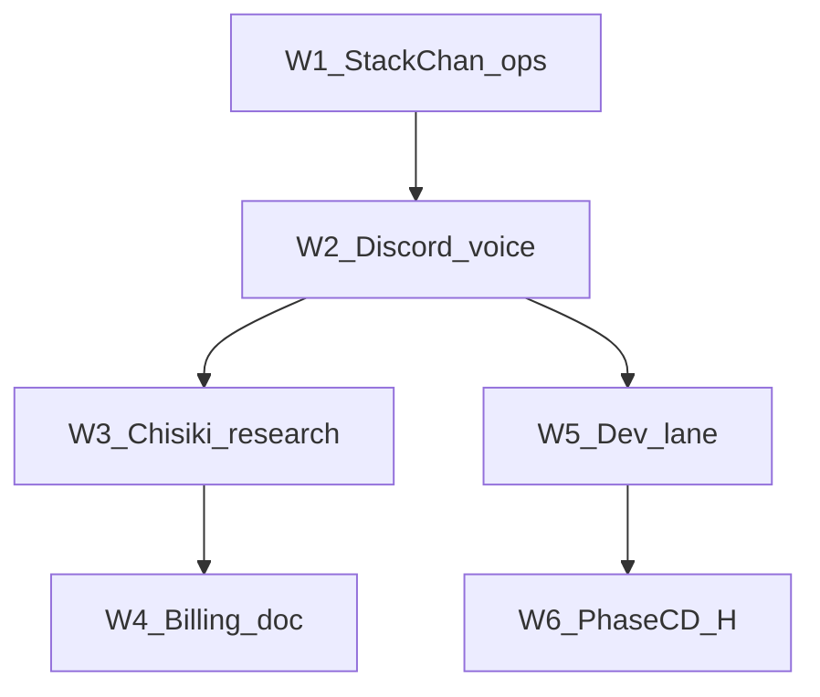

# 完全自律 — 実施波（W1–W6）

Date: 2026-05-30  
棚卸: [DESIGN_INVENTORY_2026-05-30.md](DESIGN_INVENTORY_2026-05-30.md)



| Wave | 内容 | Status | 検証 |
|------|------|--------|------|
| **W1** | SC-001 midNod、聴感、Discord 読み上げ | **done**（2026-05-31） | voice-check · multi-room OK |
| **W1b** | WF human GO → done（CLI） | done 2026-05-31 | human-go-advance |
| **W2** | SC-014 voice-config 統合 | done | vitest stackchan-voice-config |
| **W3** | Chisiki R0 調査 | done | research/*.md |
| **W4** | gasvault レベル A doc | done | BILLING_QUOTA_VAULT_PATTERN |
| **W5** | SHI-010〜014 dev pipeline | **done**（2026-05-31） | preflight + dev-pipeline ON + WF 完走 + zone vitest |
| **W6** | Phase C/D 生活・金融 | deferred | JARVIS C/D |

## 実施コマンド

```powershell
node scripts/shikishima-autonomy-status.mjs          # 全体進捗 %
node scripts/shikishima-autonomy-status.mjs --heal-eval
npx vitest run tests/hermes/zone/full-autonomy
node scripts/shikishima-run-autonomy-gap-tasks.mjs
node scripts/shikishima-research-brief.mjs --topic chisiki
node scripts/shikishima-stackchan-resume.mjs   # 聴感はイベント都度
node scripts/shikishima-process-preflight.mjs --clean --restart-dev
```

Discord: `!autonomy progress` · `!workflow status` · `!workflow done`  
設計正本: [FULL_AUTONOMY_MASTER_DESIGN_2026-05-31.md](FULL_AUTONOMY_MASTER_DESIGN_2026-05-31.md)  
運用プレイブック: [AUTONOMY_55_TO_100_CURSOR_PLAYBOOK_2026-05-31.md](AUTONOMY_55_TO_100_CURSOR_PLAYBOOK_2026-05-31.md)

## deferred（Wave に入れない）

- 24h 無人コーディング
- 憲法 execution=enabled
- FX/EA 自動売買
- CKT オンチェーン（C）
- STT 常時 ON
