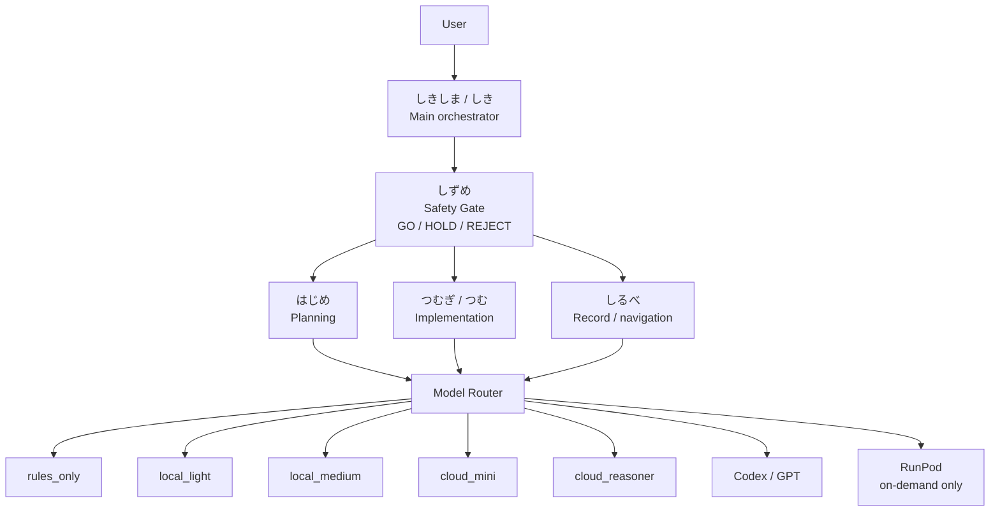
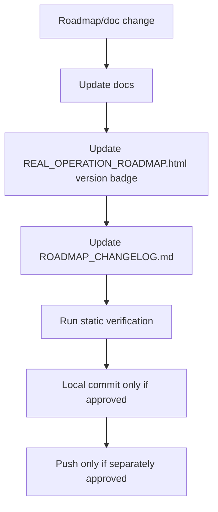
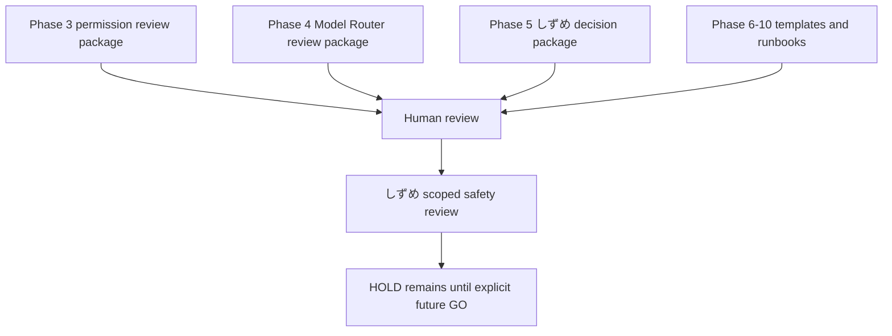
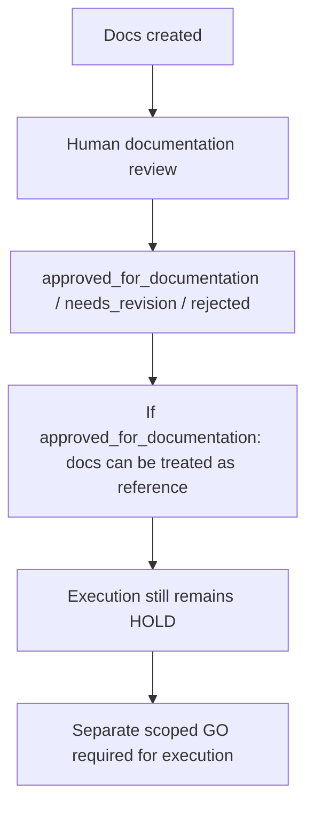
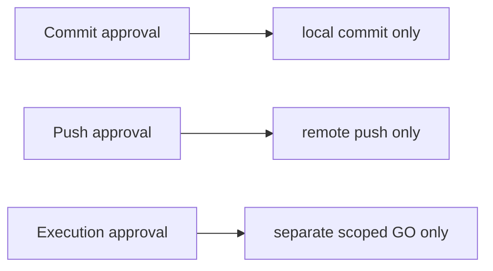
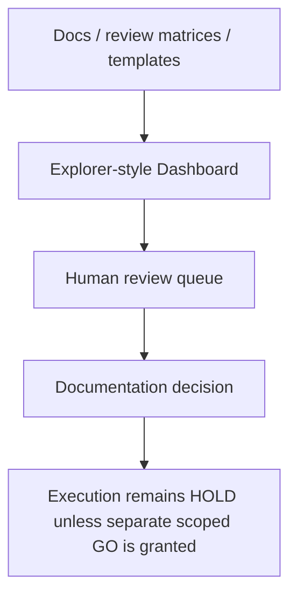

# Shikishima System Diagram

## Overall System



## Device Roles

```text
RTX 4070 PC
  = main development and local runtime base

Lenovo TAB6
  = display monitor

Redmi 12
  = prototype face/expression terminal

StackChan
  = future physical expression robot
  = safety gate required

iPhone 15 Pro
  = private / read-only / planning and approval notes

Mini PC
  = deferred / optional always-on control node
```

## HOLD Reason

```text
Current HOLD reasons:
  - Shizume Safety Gate policy is not fully approved.
  - agent permissions are not fully approved.
  - Model Router policy is not fully approved.
  - device roles are partly deferred.
  - StackChan safety gate is not implemented.
  - minimum human-supervised operation line is not approved.
```

## Roadmap Update Flow



Safety gate flow remains unchanged. Updating the roadmap does not open the
execution gate.

## v0.3.0 Phase Package Flow



Updating matrices, templates, and runbooks is documentation-only. It does not
approve WSL, Hermes, wrapper, RunPod, StackChan, git push, GO, or production
readiness.

## Documentation Review / Approval Separation Flow





## Explorer-Style Dashboard Information Flow



Dashboard non-goals:

- no wallet.
- no token system.
- no marketplace.
- no autonomous reward flow.
- no external API.

この範囲では問題を検出していません。
