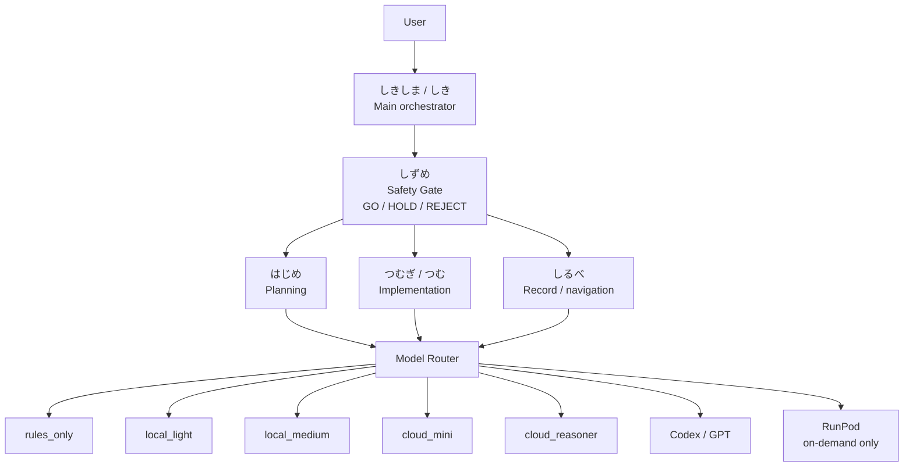

# Shikishima System Diagram

## Overall System



## Device Roles

```text
RTX 4070 PC
  = main development and local runtime base

Lenovo TAB6
  = display monitor

Redmi 12
  = prototype face/expression terminal

StackChan
  = future physical expression robot
  = safety gate required

iPhone 15 Pro
  = private / read-only / planning and approval notes

Mini PC
  = deferred / optional always-on control node
```

## HOLD Reason

```text
Current HOLD reasons:
  - Shizume Safety Gate policy is not fully approved.
  - agent permissions are not fully approved.
  - Model Router policy is not fully approved.
  - device roles are partly deferred.
  - StackChan safety gate is not implemented.
  - minimum human-supervised operation line is not approved.
```

この範囲では問題を検出していません。
