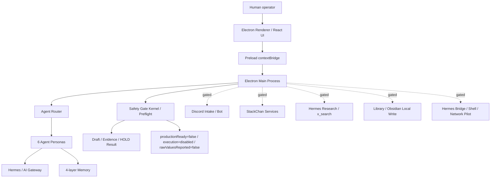

# しきしまエージェント — 内部設計全体概要

作成日: 2026-05-26
用途: GPT / 外部設計審査用のシステム概要、穴レビュー、デバッグ準備
対象: Shikishima Desktop / Hermes Desktop repository
基準: roadmap v4.40.0 系 + 2026-05-26 local HEAD state

この文書は設計審査とデバッグ準備のための資料です。
runtime 起動、StackChan 操作、Discord / X / Obsidian / 外部 API 実行、productionReady 変更、execution 有効化を承認するものではありません。

---

## 1. 現在の検証済み Git 状態

2026-05-26 JST の作業前確認:

```text
branch: main
local_HEAD: 6a317730c441ae7f97273edda88ba57e944622b2
origin_main: 8ee65fb5c2297536ce17dc5f9071e50165f11c34
commits_ahead_before_this_doc: 5
staged_before_this_doc: 0
tracked_dirty_before_this_doc: 0
untracked_before_this_doc:
  docs/shikishima/SYSTEM_DESIGN_OVERVIEW.md
```

origin/main..HEAD の既存 local commits:

```text
6a31773 feat: add stackchan sleepy screen sway
326ddce docs: record secretary guard dry run evidence
794493c docs: record secretary routine dry run evidence
45631c7 docs: record secretary v1 acceptance candidate
2c19660 docs: summarize secretary remaining work
```

本設計書の作成前に、`SYSTEM_DESIGN_OVERVIEW.md` は未追跡かつ文字化けした内容として存在していたため、UTF-8 Markdown の審査用文書として再作成する。

---

## 2. プロジェクト概要

しきしまデスクトップは、Windows 上で動作する Electron + TypeScript 製の AI 安全コントロールセンターである。

主目的:

- AI エージェントの自律開発、記録、外部連携を段階的に扱う。
- 外部操作は `HOLD` を初期状態とし、人間の明示 GO がある場合だけ一段ずつ開ける。
- StackChan、Discord、Hermes / x_search、Obsidian、Command Chat などの外部接点を一つの安全境界で管理する。
- productionReady と execution enabled は最終 gate として扱い、通常開発や検収では反転しない。

現在の安全状態:

```text
productionReady: false
execution: disabled
rawValuesReported: false
SHIKISHIMA_SHADOW_MODE: true
StackChan: HOLD
git_push_performed_by_this_task: false
```

---

## 3. 技術スタック

### Renderer

| 領域 | 主な技術 | 用途 |
|---|---|---|
| UI | React 19 / TypeScript | 画面、Agent Theater、Control Center |
| Styling | Tailwind CSS 4 | レイアウト、パネル、ステータス表示 |
| Markdown | react-markdown / remark-gfm | チャット、記録表示 |
| Build | Vite / electron-vite | renderer / main のビルド |

### Main Process

| 領域 | 主な技術 | 用途 |
|---|---|---|
| Shell | Electron | デスクトップアプリ |
| Runtime | Node.js / TypeScript | IPC、外部連携、ゲート管理 |
| Persistence | better-sqlite3 / JSON | セッション、記憶、設定 |
| Update | electron-updater | アプリ更新 |

### AI / Worker / External Integrations

| 系統 | 用途 | 現在の扱い |
|---|---|---|
| Groq / Claude / Gemini / Grok | エージェント応答、計画、分析 | ゲート下で使用 |
| Hermes Research / x_search | live research / social read | read-only GO gate |
| ClaudeCode | Shikishima core 実装 worker | 人間 GO / task 境界 |
| Codex | StackChan / scoped review worker | StackChan scope で使用 |
| Discord | read / draft / one-shot evidence | HOLD 復帰が原則 |
| StackChan | 顔、音声、モーション、秘書化 | 本文書では HOLD |

---

## 4. 高レベルアーキテクチャ



設計原則:

- Renderer から外部効果を直接起こさない。
- Preload は Main の限定 API だけを公開する。
- Main 側の外部操作候補は preflight / gate を通す。
- すべての Level 5 操作は、人間 GO、証跡、停止条件、復旧条件を必要とする。

---

## 5. エージェント構成

| ID | 名前 | 役割 | 主な担当 |
|---|---|---|---|
| `shikishima` | しきしま | 管制塔 / ユーザー窓口 | 全体判断、応答統合 |
| `shizume` | しずめ | 安全 gate / STOP 判断 | HOLD、REJECT、暴走防止 |
| `tsumugi` | つむぎ | 実装 / worker 接続 | ClaudeCode / Codex task 化 |
| `hajime` | はじめ | 設計 / 企画 / ロードマップ | 段階設計、順序決め |
| `shirube` | しるべ | 記録 / 証跡 / 知識 | docs、handoff、evidence |
| `chihaya` | ちはや | FX / XAUUSD / EA 分析 | market thesis、ポジション案 |

ルーティングは `src/main/agent-router.ts` が中心。
直接呼びかけ、安全系、実装系、計画系、記録系、FX 系などをキーワードと文脈で振り分ける。

審査ポイント:

- キーワードベース分類だけでは、複合依頼の誤分類が起きうる。
- StackChan と Shikishima core の worker routing を混同しない必要がある。
- FX / external write / productionReady / execution enabled は、どのエージェント経由でも gate を迂回してはならない。

---

## 6. 記憶とプロフィール設計

記憶は概ね 4 層で扱う。

| 層 | 内容 | リスク |
|---|---|---|
| Persistent | チーム構成、安全ルール、基本プロフィール | 古いプロフィールが応答を固定化する可能性 |
| Long-term | 重要事実、ユーザー方針、マイルストーン | 禁止フレーズ更新が反映されない可能性 |
| Medium-term | 直近セッション要約 | 誤要約が次回判断に混ざる可能性 |
| Short-term | 現在会話の直近文脈 | 長い作業で脱落する可能性 |

プロフィール固定化 / 発してほしくない表現が改善されない原因候補:

1. persistent context に古い口調・禁止されていない表現が残っている。
2. long-term memory に過去の方針が残り、新しい禁止ルールより強く作用している。
3. agent persona と profile policy の優先順位が明文化されていない。
4. renderer / main / external worker のどこで最終 prompt が組まれるかが分散している。
5. StackChan 発話用の文短縮・音声向け整形で、禁止ルールが再適用されていない可能性がある。

デバッグ準備:

- prompt assembly の最終形を redacted snapshot として保存できるようにする。
- persona / memory / user preference / safety rule の優先順位表を作る。
- 禁止フレーズと置換ルールを agent 共通 policy に寄せる。
- StackChan 発話前に「voice-safe phrase policy」を一度通す。

---

## 7. Safety Gate / SHADOW_MODE

重要な実装箇所:

| ファイル | 役割 |
|---|---|
| `src/main/shikishima-core/preflight-factory.ts` | `createActionPreflight()` の生成 |
| `src/main/shikishima-core/action-gate-kernel.ts` | action decision / risk / critical action policy |
| `src/main/index.ts` | IPC 登録、`SHIKISHIMA_SHADOW_MODE` |

主要 invariant:

```text
productionReady: false
execution: disabled
rawValuesReported: false
decision: HOLD by default
humanGoApprovalRequired: true for Level 5
```

`SHIKISHIMA_SHADOW_MODE = true` は、起動時の自動サービス稼働を抑止するための全体ブレーキである。

HOLD 対象の代表:

- Discord Bot polling
- StackChan status loop / speech / face / STT server
- daily research pipeline
- Hermes bridge / network pilot
- Command Chat send
- x_search / social read
- Obsidian write
- productionReady true
- execution enabled

審査ポイント:

- SHADOW_MODE は「自動起動」を止めるが、手動 IPC 呼び出しまで必ず止めるとは限らない。
- Renderer / preload 経由で呼べる外部操作候補は、Main 側でも個別に gate 確認が必要。
- gate 結果が draft なのか実行なのか、UI ラベルと戻り値で一致させる必要がある。

---

## 8. 外部操作経路の穴レビュー

### 8.1 StackChan

現在の扱い:

```text
StackChan: HOLD
firmware / device operation: HOLD
motion / dance / camera / mic / voice loop: HOLD
additional burn / erase / firmware exporter start: HOLD
```

関係ファイル:

- `src/main/stackchan-local-service.ts`
- `src/main/stackchan-stt-service.ts`
- `src/preload/index.ts`
- `docs/firmware/shikishima_cores3/`

現在のローカル HEAD には StackChan sleepy screen sway 実装 commit が含まれるが、本設計審査では StackChan 追加操作は行わない。

穴候補:

- preload が `stackchanSay` / `stackchanFace` などを公開しているため、Main 側の gate が薄いと UI から発話・表情操作が進みうる。
- VOICEVOX / WebSocket / firmware control は外部効果なので、one-shot GO と session GO を分ける必要がある。
- camera / microphone / continuous monitoring は、通常の「音声出力」より強い privacy gate を必要とする。

必要なデバッグ準備:

- StackChan callable IPC 一覧を作る。
- 各 IPC が draft-only / one-shot / runtime session / firmware operation のどれか分類する。
- StackChan HOLD 時の戻り値を統一する。

### 8.2 Discord

関係ファイル:

- `src/main/discord-intake.ts`
- `src/main/discord-bot-service.ts`

穴候補:

- read-only と write / reply の境界が曖昧になると、draft のつもりが送信に変わる。
- token 読み取り、ログ出力、エラー出力で raw token が漏れるリスク。
- bot polling は SHADOW_MODE と別に、手動開始経路も確認が必要。

必要なデバッグ準備:

- `DIS01_HOLD` / reply gate / one-shot send count の現在値を証跡化。
- retry loop が存在しないことをテストで確認。
- message send は必ず exact GO reference と evidence path を必要にする。

### 8.3 Hermes Bridge / Command / Shell / Network

関係ファイル候補:

- `src/main/ichikishima/hermes/`
- `src/main/hermes-research-runner.ts`
- `src/main/research-pipeline.ts`
- `src/main/claw3d.ts`

穴候補:

- `execute_shell` / `network_http` 型の payload は非常に強い外部効果を持つ。
- npm / git / dev server / process spawn は、runtime start や external write と同等に gate 対象。
- `claw3d.ts` のような helper が、開発便利機能として gate を迂回しないか確認が必要。

必要なデバッグ準備:

- renderer から呼べる shell/network/dev-server 系 IPC の棚卸し。
- `npm run dev` / runtime start / bridge connect は RUNTIME-GO のみ。
- shell command は evidence + time_window + stop condition なしでは実行不可にする。

### 8.4 Obsidian / Library Export

関係ファイル:

- `src/main/library-export.ts`
- `src/main/shikishima-core/secretary-*`

穴候補:

- local write は外部 API ではないが、永続的なファイル変更である。
- arbitrary path write にならないよう、scope 固定と path redaction が必要。
- dry-run と actual write の境界を UI と戻り値で明確にする。

### 8.5 X / x_search / Grok

穴候補:

- social read と social write を混同しない。
- x_search は read-only GO であり、post / reply / DM / like / follow は別 GO または HARD STOP。
- Grok / X OAuth は token / scope / storage policy を明示しない限り開始しない。

### 8.6 productionReady / execution enabled

最重要 gate:

```text
productionReady true: critical Level 5
execution enabled: critical Level 5
```

穴候補:

- docs 上の "ready" 表記が、コード上の `productionReady` と混同される。
- assistant / agent が「実装完了」を「本番化」と誤認する。
- execution enabled を UI toggle で置くと誤操作のリスクが高い。

必要な方針:

- productionReady と execution enabled は、UI では状態表示のみ。
- 変更は別 gate、別 commit、別 evidence、別 human GO。

---

## 9. StackChan 章 — HOLD 固定版

StackChan は一旦 HOLD とする。

HOLD の意味:

- 追加 firmware build / upload をしない。
- Burn / Erase / Firmware Exporter Start をしない。
- servo / dance / motion 実機操作をしない。
- camera / microphone / always-on monitoring を開始しない。
- voice loop / autonomous conversation を開始しない。
- StackChan を productionReady 判定の根拠にしない。

既存の進捗:

- CoreS3 firmware 実験、LED、servo、sleepy screen sway などの実装履歴がある。
- 実機の目視確認・動作調整は進んだが、本設計審査では再開しない。
- StackChan 秘書化ロードマップは別 docs に分離し、Shikishima core の安全設計レビューと混ぜない。

審査観点:

- StackChan は「顔・声・出力装置」であり、しきしま本体の判断・記憶・外部操作 gate と分離する。
- しきしまから StackChan へ送るテキストは、voice-safe / persona-safe / privacy-safe policy を通す。
- camera / mic を使う場合は one-shot と continuous を別 gate にする。

---

## 10. デバッグ準備チェックリスト

### 10.1 設計とコードの同期

- [ ] docs の agent role と `src/main/agent-definitions.ts` の ID / role が一致している。
- [ ] `agent-router.ts` の優先順位が docs と矛盾していない。
- [ ] persona / profile / memory policy の優先順位が明文化されている。
- [ ] StackChan を HOLD として扱う docs と UI 表示が一致している。

### 10.2 Gate coverage

- [ ] preload で公開された API が全て棚卸しされている。
- [ ] 外部 read / write / runtime / firmware / shell / network の分類表がある。
- [ ] `createActionPreflight()` を通らない外部操作候補がないか確認済み。
- [ ] SHADOW_MODE が自動起動だけでなく手動 IPC の誤実行も止める設計になっている。

### 10.3 Raw value / secret control

- [ ] token / API key / raw LAN IP / raw device ID / raw local path を docs に残さない。
- [ ] evidence では redacted value のみ使う。
- [ ] error log に raw token が出ない。

### 10.4 Runtime / automation

- [ ] runtime start は time_window, command, shutdown, evidence が必須。
- [ ] recurring automation / daemon / polling は明示 gate なしで開始しない。
- [ ] retry loop と auto-escalation は禁止。

### 10.5 Secretary / autonomous operation

- [ ] one-shot, bounded session, continuous monitoring を別 gate にする。
- [ ] external write executor は draft / dry-run / actual write を明確に分ける。
- [ ] status snapshot は redacted で、raw values を含めない。

---

## 11. GPT 審査依頼ポイント

GPT / 外部レビュアーには、以下を重点的に確認してほしい。

1. `SHIKISHIMA_SHADOW_MODE` と `createActionPreflight()` だけでは捕捉できない外部操作経路がないか。
2. preload exposed API から、実行系 IPC を直接呼べる穴がないか。
3. StackChan HOLD と Shikishima core の safety gate が混線していないか。
4. Discord / x_search / Obsidian / Hermes Bridge の read/write 境界が明確か。
5. productionReady / execution enabled の表記が、実装完了や検収完了と混同されないか。
6. 記憶・プロフィール・persona policy の優先順位が、発話禁止や口調修正を確実に反映できるか。
7. FX / market position proposal が external action や financial advice と誤解されない gate 表現になっているか。
8. エージェント討論モードで、最終判断者と安全 gate の責任が曖昧にならないか。

---

## 12. 推奨される次の実装前タスク

1. **Preload / IPC External Surface Audit**
   - preload 公開 API と main handler を一覧化し、draft / read-only / write / runtime / firmware に分類。

2. **Profile / Phrase Policy Debug**
   - 禁止フレーズ、persona、memory の優先順位を固定し、StackChan 発話前にも適用。

3. **Agent AI Assignment Consistency Review**
   - 各 agent の primary / fallback model と task scope を docs + code で照合。

4. **Secretary Status Snapshot Redaction Test**
   - raw token / LAN IP / local path / device ID が snapshot に出ないことを検証。

5. **External Gate Table**
   - Discord, Obsidian, x_search, Hermes Bridge, Command Chat, StackChan, FX publishing を一枚表にまとめる。

6. **Discussion Mode Safety Design**
   - agent 討論モードで、提案、反対、判定、最終 human GO の役割を固定。

---

## 13. 本設計書の結論

現在の Shikishima は、機能実装の量よりも安全境界と外部操作経路の整理が重要な段階にある。

結論:

```text
Shikishima core:
  design review and debug preparation: READY
  productionReady: false
  execution: disabled

StackChan:
  HOLD
  no new firmware/device operation in this review

External actions:
  gated
  no autonomous write / runtime / OAuth / social write

Next:
  audit IPC / gate coverage before opening further Level 5 paths
```

この文書は、GPT 審査に渡すための最終版設計概要であり、実行承認ではない。
